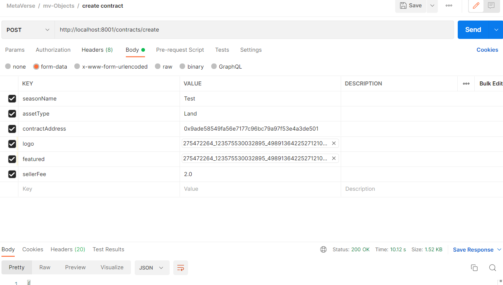
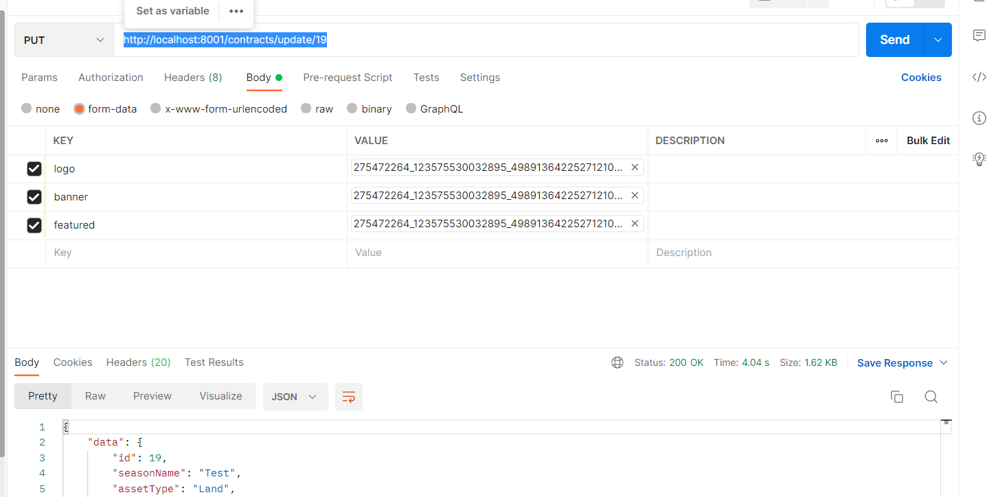
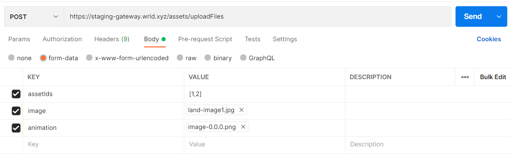

# WRLD Metaverse Authentication APIs - mv-objects

:warning: This service is under development and has not yet been fully reviewed or tested for use in production. :warning:

## Requirements

- npm (node:15.14.0 tested)

## Development

1. Run `npm install`
2. Set the environment variables
   - DATABASE_URL: <DATABASE_URL>
   - DEV_DATABASE_URL: <DEV_DATABASE_URL>
   - NODE_ENV: <NODE_ENV>
   - APP_PORT: <APP_PORT>
   - INFURA_BLOCK_CHAIN_URL: <INFURA_BLOCK_CHAIN_URL>
   - MV_AUTH_URL: <MV_AUTH_URL>
   - BASE_URL: <BASE_URL>
   - CRYPT_KEY: <CRYPT_KEY>
   - AWS_BUCKET_NAME: <AWS_BUCKET_NAME>
   - AWS_BUCKET_REGION: <AWS_BUCKET_REGION>
   - AWS_ACCESS_KEY: <AWS_ACCESS_KEY>
   - AWS_SECRET_KEY: <AWS_SECRET_KEY>
   - MINT_WALLET_ADDRESS: <MINT_WALLET_ADDRESS>
   - MINT_WALLET_PRIVATE_KEY: <MINT_WALLET_PRIVATE_KEY>
   - IPFS_NODE_URL=<IPFS_NODE_URL>
   - BLOCK_CHAIN_API_URL=<BLOCK_CHAIN_API_URL>
   - HTTP_CLIENT_TIMEOUT=<HTTP_CLIENT_TIMEOUT>
   - PINATA_API_KEY=<PINATA_API_KEY>
   - PINATA_API_SECRET=<PINATA_API_SECRET>
   - PINATA_PIN_JSON_URL=<PINATA_PIN_JSON_URL>
   - PINATA_PIN_FILE_URL=<PINATA_PIN_FILE_URL>
   - PINATA_GET_URL=<PINATA_GET_URL>
3. Run `npm run start`

## Production builds

1. Set the environment variables

   - DATABASE_URL: <DATABASE_URL>
   - DEV_DATABASE_URL: <DEV_DATABASE_URL>
   - NODE_ENV: <NODE_ENV>
   - APP_PORT: <APP_PORT>
   - INFURA_BLOCK_CHAIN_URL: <INFURA_BLOCK_CHAIN_URL>
   - MV_AUTH_URL: <MV_AUTH_URL>
   - BASE_URL: <BASE_URL>
   - CRYPT_KEY: <CRYPT_KEY>
   - AWS_BUCKET_NAME: <AWS_BUCKET_NAME>
   - AWS_BUCKET_REGION: <AWS_BUCKET_REGION>
   - AWS_ACCESS_KEY: <AWS_ACCESS_KEY>
   - AWS_SECRET_KEY: <AWS_SECRET_KEY>
   - MINT_WALLET_ADDRESS: <MINT_WALLET_ADDRESS>
   - MINT_WALLET_PRIVATE_KEY: <MINT_WALLET_PRIVATE_KEY>
   - IPFS_NODE_URL=<IPFS_NODE_URL>
   - BLOCK_CHAIN_API_URL=<BLOCK_CHAIN_API_URL>
   - HTTP_CLIENT_TIMEOUT=<HTTP_CLIENT_TIMEOUT>
   - PINATA_API_KEY=<PINATA_API_KEY>
   - PINATA_API_SECRET=<PINATA_API_SECRET>
   - PINATA_PIN_JSON_URL=<PINATA_PIN_JSON_URL>
   - PINATA_PIN_FILE_URL=<PINATA_PIN_FILE_URL>
   - PINATA_GET_URL=<PINATA_GET_URL>

2. Run `docker file in EKS folder`

This will build a docker container and deploy the application into that container and will trigger to run the application.

## APIs

## Contract APIs

### https://staging-services.wrld.xyz/contracts/

###$ Description:
This api is used get all the contracts defined in the system.

**method**

GET

**input json**

N/A

**output json**

```
{
    "data": [
        {
            "id": 1,
            "seasonName": "Season-1",
            "assetType": "land",
            "contractAddress": "0x4f9b18903bDC862731233c6ECe29c1A2969abbA9",
            "contractAbi": [
                {
                    "inputs": [
                        {
                            "internalType": "uint256",
                            "name": "_mintSupplyCount",
                            "type": "uint256"
                        },
                        {
                            "internalType": "uint256",
                            "name": "_ownerMintReserveCount",
                            "type": "uint256"
                        },
                        {
                            "internalType": "uint256",
                            "name": "_maxWhitelistCount",
                            "type": "uint256"
                        },
                        {
                            "internalType": "uint256",
                            "name": "_maxMintPerAddress",
                            "type": "uint256"
                        }
                    ],
                    "stateMutability": "nonpayable",
                    "type": "constructor"
                },
                {
                    "anonymous": false,
                    "inputs": [
                        {
                            "indexed": true,
                            "internalType": "address",
                            "name": "owner",
                            "type": "address"
                        },
                        {
                            "indexed": true,
                            "internalType": "address",
                            "name": "approved",
                            "type": "address"
                        },
                        {
                            "indexed": true,
                            "internalType": "uint256",
                            "name": "tokenId",
                            "type": "uint256"
                        }
                    ],
                    "name": "Approval",
                    "type": "event"
                },
                {
                    "anonymous": false,
                    "inputs": [
                        {
                            "indexed": true,
                            "internalType": "address",
                            "name": "owner",
                            "type": "address"
                        },
                        {
                            "indexed": true,
                            "internalType": "address",
                            "name": "operator",
                            "type": "address"
                        },
                        {
                            "indexed": false,
                            "internalType": "bool",
                            "name": "approved",
                            "type": "bool"
                        }
                    ],
                    "name": "ApprovalForAll",
                    "type": "event"
                },
                {
                    "anonymous": false,
                    "inputs": [
                        {
                            "indexed": true,
                            "internalType": "address",
                            "name": "previousOwner",
                            "type": "address"
                        },
                        {
                            "indexed": true,
                            "internalType": "address",
                            "name": "newOwner",
                            "type": "address"
                        }
                    ],
                    "name": "OwnershipTransferred",
                    "type": "event"
                },
                {
                    "anonymous": false,
                    "inputs": [
                        {
                            "indexed": true,
                            "internalType": "address",
                            "name": "from",
                            "type": "address"
                        },
                        {
                            "indexed": true,
                            "internalType": "address",
                            "name": "to",
                            "type": "address"
                        },
                        {
                            "indexed": true,
                            "internalType": "uint256",
                            "name": "tokenId",
                            "type": "uint256"
                        }
                    ],
                    "name": "Transfer",
                    "type": "event"
                },
                {
                    "inputs": [
                        {
                            "internalType": "address",
                            "name": "to",
                            "type": "address"
                        },
                        {
                            "internalType": "uint256",
                            "name": "tokenId",
                            "type": "uint256"
                        }
                    ],
                    "name": "approve",
                    "outputs": [],
                    "stateMutability": "nonpayable",
                    "type": "function"
                },
                {
                    "inputs": [
                        {
                            "internalType": "address",
                            "name": "_useraddr",
                            "type": "address"
                        }
                    ],
                    "name": "areYouWhitelistedaddress",
                    "outputs": [
                        {
                            "internalType": "bool",
                            "name": "",
                            "type": "bool"
                        }
                    ],
                    "stateMutability": "view",
                    "type": "function"
                },
                {
                    "inputs": [
                        {
                            "internalType": "address",
                            "name": "owner",
                            "type": "address"
                        }
                    ],
                    "name": "balanceOf",
                    "outputs": [
                        {
                            "internalType": "uint256",
                            "name": "",
                            "type": "uint256"
                        }
                    ],
                    "stateMutability": "view",
                    "type": "function"
                },
                {
                    "inputs": [],
                    "name": "baseUri",
                    "outputs": [
                        {
                            "internalType": "string",
                            "name": "",
                            "type": "string"
                        }
                    ],
                    "stateMutability": "view",
                    "type": "function"
                },
                {
                    "inputs": [
                        {
                            "internalType": "uint256",
                            "name": "tokenId",
                            "type": "uint256"
                        }
                    ],
                    "name": "getApproved",
                    "outputs": [
                        {
                            "internalType": "address",
                            "name": "",
                            "type": "address"
                        }
                    ],
                    "stateMutability": "view",
                    "type": "function"
                },
                {
                    "inputs": [
                        {
                            "internalType": "uint256",
                            "name": "_tokenId",
                            "type": "uint256"
                        }
                    ],
                    "name": "getTokenMetaData",
                    "outputs": [
                        {
                            "components": [
                                {
                                    "internalType": "string",
                                    "name": "metaData",
                                    "type": "string"
                                },
                                {
                                    "internalType": "string",
                                    "name": "season",
                                    "type": "string"
                                }
                            ],
                            "internalType": "struct WRLDLand.LandData",
                            "name": "",
                            "type": "tuple"
                        }
                    ],
                    "stateMutability": "view",
                    "type": "function"
                },
                {
                    "inputs": [
                        {
                            "internalType": "address",
                            "name": "owner",
                            "type": "address"
                        },
                        {
                            "internalType": "address",
                            "name": "operator",
                            "type": "address"
                        }
                    ],
                    "name": "isApprovedForAll",
                    "outputs": [
                        {
                            "internalType": "bool",
                            "name": "",
                            "type": "bool"
                        }
                    ],
                    "stateMutability": "view",
                    "type": "function"
                },
                {
                    "inputs": [],
                    "name": "mintEnabled",
                    "outputs": [
                        {
                            "internalType": "bool",
                            "name": "",
                            "type": "bool"
                        }
                    ],
                    "stateMutability": "view",
                    "type": "function"
                },
                {
                    "inputs": [
                        {
                            "components": [
                                {
                                    "internalType": "uint256",
                                    "name": "_tokenId",
                                    "type": "uint256"
                                },
                                {
                                    "internalType": "string",
                                    "name": "_tokenMetadataHash",
                                    "type": "string"
                                },
                                {
                                    "components": [
                                        {
                                            "internalType": "string",
                                            "name": "metaData",
                                            "type": "string"
                                        },
                                        {
                                            "internalType": "string",
                                            "name": "season",
                                            "type": "string"
                                        }
                                    ],
                                    "internalType": "struct WRLDLand.LandData",
                                    "name": "_LandData",
                                    "type": "tuple"
                                }
                            ],
                            "internalType": "struct WRLDLand.MintData",
                            "name": "_mintData",
                            "type": "tuple"
                        }
                    ],
                    "name": "mintSingleLand",
                    "outputs": [],
                    "stateMutability": "nonpayable",
                    "type": "function"
                },
                {
                    "inputs": [],
                    "name": "mintSupplyCount",
                    "outputs": [
                        {
                            "internalType": "uint256",
                            "name": "",
                            "type": "uint256"
                        }
                    ],
                    "stateMutability": "view",
                    "type": "function"
                },
                {
                    "inputs": [
                        {
                            "components": [
                                {
                                    "internalType": "uint256",
                                    "name": "_tokenId",
                                    "type": "uint256"
                                },
                                {
                                    "internalType": "string",
                                    "name": "_tokenMetadataHash",
                                    "type": "string"
                                },
                                {
                                    "components": [
                                        {
                                            "internalType": "string",
                                            "name": "metaData",
                                            "type": "string"
                                        },
                                        {
                                            "internalType": "string",
                                            "name": "season",
                                            "type": "string"
                                        }
                                    ],
                                    "internalType": "struct WRLDLand.LandData",
                                    "name": "_LandData",
                                    "type": "tuple"
                                }
                            ],
                            "internalType": "struct WRLDLand.MintData[]",
                            "name": "_mintData",
                            "type": "tuple[]"
                        }
                    ],
                    "name": "mintmultipleLand",
                    "outputs": [],
                    "stateMutability": "nonpayable",
                    "type": "function"
                },
                {
                    "inputs": [],
                    "name": "name",
                    "outputs": [
                        {
                            "internalType": "string",
                            "name": "",
                            "type": "string"
                        }
                    ],
                    "stateMutability": "view",
                    "type": "function"
                },
                {
                    "inputs": [],
                    "name": "owner",
                    "outputs": [
                        {
                            "internalType": "address",
                            "name": "",
                            "type": "address"
                        }
                    ],
                    "stateMutability": "view",
                    "type": "function"
                },
                {
                    "inputs": [
                        {
                            "internalType": "uint256",
                            "name": "tokenId",
                            "type": "uint256"
                        }
                    ],
                    "name": "ownerOf",
                    "outputs": [
                        {
                            "internalType": "address",
                            "name": "",
                            "type": "address"
                        }
                    ],
                    "stateMutability": "view",
                    "type": "function"
                },
                {
                    "inputs": [
                        {
                            "internalType": "address",
                            "name": "_user",
                            "type": "address"
                        }
                    ],
                    "name": "removeWhitelistUser",
                    "outputs": [],
                    "stateMutability": "nonpayable",
                    "type": "function"
                },
                {
                    "inputs": [],
                    "name": "renounceOwnership",
                    "outputs": [],
                    "stateMutability": "nonpayable",
                    "type": "function"
                },
                {
                    "inputs": [
                        {
                            "internalType": "address",
                            "name": "from",
                            "type": "address"
                        },
                        {
                            "internalType": "address",
                            "name": "to",
                            "type": "address"
                        },
                        {
                            "internalType": "uint256",
                            "name": "tokenId",
                            "type": "uint256"
                        }
                    ],
                    "name": "safeTransferFrom",
                    "outputs": [],
                    "stateMutability": "nonpayable",
                    "type": "function"
                },
                {
                    "inputs": [
                        {
                            "internalType": "address",
                            "name": "from",
                            "type": "address"
                        },
                        {
                            "internalType": "address",
                            "name": "to",
                            "type": "address"
                        },
                        {
                            "internalType": "uint256",
                            "name": "tokenId",
                            "type": "uint256"
                        },
                        {
                            "internalType": "bytes",
                            "name": "_data",
                            "type": "bytes"
                        }
                    ],
                    "name": "safeTransferFrom",
                    "outputs": [],
                    "stateMutability": "nonpayable",
                    "type": "function"
                },
                {
                    "inputs": [
                        {
                            "internalType": "address",
                            "name": "operator",
                            "type": "address"
                        },
                        {
                            "internalType": "bool",
                            "name": "approved",
                            "type": "bool"
                        }
                    ],
                    "name": "setApprovalForAll",
                    "outputs": [],
                    "stateMutability": "nonpayable",
                    "type": "function"
                },
                {
                    "inputs": [
                        {
                            "internalType": "string",
                            "name": "_baseUri",
                            "type": "string"
                        }
                    ],
                    "name": "setBaseUri",
                    "outputs": [],
                    "stateMutability": "nonpayable",
                    "type": "function"
                },
                {
                    "inputs": [
                        {
                            "internalType": "bool",
                            "name": "_enabled",
                            "type": "bool"
                        }
                    ],
                    "name": "setMintEnabled",
                    "outputs": [],
                    "stateMutability": "nonpayable",
                    "type": "function"
                },
                {
                    "inputs": [
                        {
                            "internalType": "bytes4",
                            "name": "interfaceId",
                            "type": "bytes4"
                        }
                    ],
                    "name": "supportsInterface",
                    "outputs": [
                        {
                            "internalType": "bool",
                            "name": "",
                            "type": "bool"
                        }
                    ],
                    "stateMutability": "view",
                    "type": "function"
                },
                {
                    "inputs": [],
                    "name": "symbol",
                    "outputs": [
                        {
                            "internalType": "string",
                            "name": "",
                            "type": "string"
                        }
                    ],
                    "stateMutability": "view",
                    "type": "function"
                },
                {
                    "inputs": [
                        {
                            "internalType": "uint256",
                            "name": "index",
                            "type": "uint256"
                        }
                    ],
                    "name": "tokenByIndex",
                    "outputs": [
                        {
                            "internalType": "uint256",
                            "name": "",
                            "type": "uint256"
                        }
                    ],
                    "stateMutability": "view",
                    "type": "function"
                },
                {
                    "inputs": [
                        {
                            "internalType": "uint256",
                            "name": "",
                            "type": "uint256"
                        }
                    ],
                    "name": "tokenMetaData",
                    "outputs": [
                        {
                            "internalType": "string",
                            "name": "metaData",
                            "type": "string"
                        },
                        {
                            "internalType": "string",
                            "name": "season",
                            "type": "string"
                        }
                    ],
                    "stateMutability": "view",
                    "type": "function"
                },
                {
                    "inputs": [
                        {
                            "internalType": "uint256",
                            "name": "",
                            "type": "uint256"
                        }
                    ],
                    "name": "tokenMetadataHashs",
                    "outputs": [
                        {
                            "internalType": "string",
                            "name": "",
                            "type": "string"
                        }
                    ],
                    "stateMutability": "view",
                    "type": "function"
                },
                {
                    "inputs": [
                        {
                            "internalType": "address",
                            "name": "owner",
                            "type": "address"
                        },
                        {
                            "internalType": "uint256",
                            "name": "index",
                            "type": "uint256"
                        }
                    ],
                    "name": "tokenOfOwnerByIndex",
                    "outputs": [
                        {
                            "internalType": "uint256",
                            "name": "",
                            "type": "uint256"
                        }
                    ],
                    "stateMutability": "view",
                    "type": "function"
                },
                {
                    "inputs": [
                        {
                            "internalType": "uint256",
                            "name": "_tokenId",
                            "type": "uint256"
                        }
                    ],
                    "name": "tokenURI",
                    "outputs": [
                        {
                            "internalType": "string",
                            "name": "",
                            "type": "string"
                        }
                    ],
                    "stateMutability": "view",
                    "type": "function"
                },
                {
                    "inputs": [],
                    "name": "totalMinted",
                    "outputs": [
                        {
                            "internalType": "uint256",
                            "name": "",
                            "type": "uint256"
                        }
                    ],
                    "stateMutability": "view",
                    "type": "function"
                },
                {
                    "inputs": [],
                    "name": "totalSupply",
                    "outputs": [
                        {
                            "internalType": "uint256",
                            "name": "",
                            "type": "uint256"
                        }
                    ],
                    "stateMutability": "view",
                    "type": "function"
                },
                {
                    "inputs": [
                        {
                            "internalType": "address",
                            "name": "from",
                            "type": "address"
                        },
                        {
                            "internalType": "address",
                            "name": "to",
                            "type": "address"
                        },
                        {
                            "internalType": "uint256",
                            "name": "tokenId",
                            "type": "uint256"
                        }
                    ],
                    "name": "transferFrom",
                    "outputs": [],
                    "stateMutability": "nonpayable",
                    "type": "function"
                },
                {
                    "inputs": [
                        {
                            "internalType": "address",
                            "name": "newOwner",
                            "type": "address"
                        }
                    ],
                    "name": "transferOwnership",
                    "outputs": [],
                    "stateMutability": "nonpayable",
                    "type": "function"
                },
                {
                    "inputs": [
                        {
                            "internalType": "uint256",
                            "name": "_tokenId",
                            "type": "uint256"
                        },
                        {
                            "internalType": "string",
                            "name": "_tokenMetadataHash",
                            "type": "string"
                        }
                    ],
                    "name": "updateMetadataHash",
                    "outputs": [],
                    "stateMutability": "nonpayable",
                    "type": "function"
                },
                {
                    "inputs": [],
                    "name": "whitelistAddressCount",
                    "outputs": [
                        {
                            "internalType": "uint256",
                            "name": "",
                            "type": "uint256"
                        }
                    ],
                    "stateMutability": "view",
                    "type": "function"
                },
                {
                    "inputs": [],
                    "name": "whitelistMintCount",
                    "outputs": [
                        {
                            "internalType": "uint256",
                            "name": "",
                            "type": "uint256"
                        }
                    ],
                    "stateMutability": "view",
                    "type": "function"
                },
                {
                    "inputs": [
                        {
                            "internalType": "address",
                            "name": "_user",
                            "type": "address"
                        }
                    ],
                    "name": "whitelistUser",
                    "outputs": [],
                    "stateMutability": "nonpayable",
                    "type": "function"
                }
            ],
            "createdBy": "admin",
            "updatedBy": "admin",
            "isActive": null,
            "description": null,
            "category": null,
            "payoutAddress": null,
            "sellerFee": null,
            "updatedAt": "2022-04-18T09:00:00.590Z",
            "createdAt": "2021-12-31T19:00:00.000Z",
            "blockNumber": 10524896,
            "name": null,
            "logoImage": null,
            "featuredImage": null,
            "bannerImage": null
        }
    ],
    "success": true
}
```

### https://staging-services.wrld.xyz/contracts/getContractById/:id

###$ Description:
This api is used get contract information defined in the system against the contract id.

**method**

GET

**input json**

N/A

**output json**

```
{
    "data": {
        "id": 1,
        "seasonName": "Season-1",
        "assetType": "land",
        "contractAddress": "0x4f9b18903bDC862731233c6ECe29c1A2969abbA9",
        "contractAbi": [
            {
                "inputs": [
                    {
                        "internalType": "uint256",
                        "name": "_mintSupplyCount",
                        "type": "uint256"
                    },
                    {
                        "internalType": "uint256",
                        "name": "_ownerMintReserveCount",
                        "type": "uint256"
                    },
                    {
                        "internalType": "uint256",
                        "name": "_maxWhitelistCount",
                        "type": "uint256"
                    },
                    {
                        "internalType": "uint256",
                        "name": "_maxMintPerAddress",
                        "type": "uint256"
                    }
                ],
                "stateMutability": "nonpayable",
                "type": "constructor"
            },
            {
                "anonymous": false,
                "inputs": [
                    {
                        "indexed": true,
                        "internalType": "address",
                        "name": "owner",
                        "type": "address"
                    },
                    {
                        "indexed": true,
                        "internalType": "address",
                        "name": "approved",
                        "type": "address"
                    },
                    {
                        "indexed": true,
                        "internalType": "uint256",
                        "name": "tokenId",
                        "type": "uint256"
                    }
                ],
                "name": "Approval",
                "type": "event"
            },
            {
                "anonymous": false,
                "inputs": [
                    {
                        "indexed": true,
                        "internalType": "address",
                        "name": "owner",
                        "type": "address"
                    },
                    {
                        "indexed": true,
                        "internalType": "address",
                        "name": "operator",
                        "type": "address"
                    },
                    {
                        "indexed": false,
                        "internalType": "bool",
                        "name": "approved",
                        "type": "bool"
                    }
                ],
                "name": "ApprovalForAll",
                "type": "event"
            },
            {
                "anonymous": false,
                "inputs": [
                    {
                        "indexed": true,
                        "internalType": "address",
                        "name": "previousOwner",
                        "type": "address"
                    },
                    {
                        "indexed": true,
                        "internalType": "address",
                        "name": "newOwner",
                        "type": "address"
                    }
                ],
                "name": "OwnershipTransferred",
                "type": "event"
            },
            {
                "anonymous": false,
                "inputs": [
                    {
                        "indexed": true,
                        "internalType": "address",
                        "name": "from",
                        "type": "address"
                    },
                    {
                        "indexed": true,
                        "internalType": "address",
                        "name": "to",
                        "type": "address"
                    },
                    {
                        "indexed": true,
                        "internalType": "uint256",
                        "name": "tokenId",
                        "type": "uint256"
                    }
                ],
                "name": "Transfer",
                "type": "event"
            },
            {
                "inputs": [
                    {
                        "internalType": "address",
                        "name": "to",
                        "type": "address"
                    },
                    {
                        "internalType": "uint256",
                        "name": "tokenId",
                        "type": "uint256"
                    }
                ],
                "name": "approve",
                "outputs": [],
                "stateMutability": "nonpayable",
                "type": "function"
            },
            {
                "inputs": [
                    {
                        "internalType": "address",
                        "name": "_useraddr",
                        "type": "address"
                    }
                ],
                "name": "areYouWhitelistedaddress",
                "outputs": [
                    {
                        "internalType": "bool",
                        "name": "",
                        "type": "bool"
                    }
                ],
                "stateMutability": "view",
                "type": "function"
            },
            {
                "inputs": [
                    {
                        "internalType": "address",
                        "name": "owner",
                        "type": "address"
                    }
                ],
                "name": "balanceOf",
                "outputs": [
                    {
                        "internalType": "uint256",
                        "name": "",
                        "type": "uint256"
                    }
                ],
                "stateMutability": "view",
                "type": "function"
            },
            {
                "inputs": [],
                "name": "baseUri",
                "outputs": [
                    {
                        "internalType": "string",
                        "name": "",
                        "type": "string"
                    }
                ],
                "stateMutability": "view",
                "type": "function"
            },
            {
                "inputs": [
                    {
                        "internalType": "uint256",
                        "name": "tokenId",
                        "type": "uint256"
                    }
                ],
                "name": "getApproved",
                "outputs": [
                    {
                        "internalType": "address",
                        "name": "",
                        "type": "address"
                    }
                ],
                "stateMutability": "view",
                "type": "function"
            },
            {
                "inputs": [
                    {
                        "internalType": "uint256",
                        "name": "_tokenId",
                        "type": "uint256"
                    }
                ],
                "name": "getTokenMetaData",
                "outputs": [
                    {
                        "components": [
                            {
                                "internalType": "string",
                                "name": "metaData",
                                "type": "string"
                            },
                            {
                                "internalType": "string",
                                "name": "season",
                                "type": "string"
                            }
                        ],
                        "internalType": "struct WRLDLand.LandData",
                        "name": "",
                        "type": "tuple"
                    }
                ],
                "stateMutability": "view",
                "type": "function"
            },
            {
                "inputs": [
                    {
                        "internalType": "address",
                        "name": "owner",
                        "type": "address"
                    },
                    {
                        "internalType": "address",
                        "name": "operator",
                        "type": "address"
                    }
                ],
                "name": "isApprovedForAll",
                "outputs": [
                    {
                        "internalType": "bool",
                        "name": "",
                        "type": "bool"
                    }
                ],
                "stateMutability": "view",
                "type": "function"
            },
            {
                "inputs": [],
                "name": "mintEnabled",
                "outputs": [
                    {
                        "internalType": "bool",
                        "name": "",
                        "type": "bool"
                    }
                ],
                "stateMutability": "view",
                "type": "function"
            },
            {
                "inputs": [
                    {
                        "components": [
                            {
                                "internalType": "uint256",
                                "name": "_tokenId",
                                "type": "uint256"
                            },
                            {
                                "internalType": "string",
                                "name": "_tokenMetadataHash",
                                "type": "string"
                            },
                            {
                                "components": [
                                    {
                                        "internalType": "string",
                                        "name": "metaData",
                                        "type": "string"
                                    },
                                    {
                                        "internalType": "string",
                                        "name": "season",
                                        "type": "string"
                                    }
                                ],
                                "internalType": "struct WRLDLand.LandData",
                                "name": "_LandData",
                                "type": "tuple"
                            }
                        ],
                        "internalType": "struct WRLDLand.MintData",
                        "name": "_mintData",
                        "type": "tuple"
                    }
                ],
                "name": "mintSingleLand",
                "outputs": [],
                "stateMutability": "nonpayable",
                "type": "function"
            },
            {
                "inputs": [],
                "name": "mintSupplyCount",
                "outputs": [
                    {
                        "internalType": "uint256",
                        "name": "",
                        "type": "uint256"
                    }
                ],
                "stateMutability": "view",
                "type": "function"
            },
            {
                "inputs": [
                    {
                        "components": [
                            {
                                "internalType": "uint256",
                                "name": "_tokenId",
                                "type": "uint256"
                            },
                            {
                                "internalType": "string",
                                "name": "_tokenMetadataHash",
                                "type": "string"
                            },
                            {
                                "components": [
                                    {
                                        "internalType": "string",
                                        "name": "metaData",
                                        "type": "string"
                                    },
                                    {
                                        "internalType": "string",
                                        "name": "season",
                                        "type": "string"
                                    }
                                ],
                                "internalType": "struct WRLDLand.LandData",
                                "name": "_LandData",
                                "type": "tuple"
                            }
                        ],
                        "internalType": "struct WRLDLand.MintData[]",
                        "name": "_mintData",
                        "type": "tuple[]"
                    }
                ],
                "name": "mintmultipleLand",
                "outputs": [],
                "stateMutability": "nonpayable",
                "type": "function"
            },
            {
                "inputs": [],
                "name": "name",
                "outputs": [
                    {
                        "internalType": "string",
                        "name": "",
                        "type": "string"
                    }
                ],
                "stateMutability": "view",
                "type": "function"
            },
            {
                "inputs": [],
                "name": "owner",
                "outputs": [
                    {
                        "internalType": "address",
                        "name": "",
                        "type": "address"
                    }
                ],
                "stateMutability": "view",
                "type": "function"
            },
            {
                "inputs": [
                    {
                        "internalType": "uint256",
                        "name": "tokenId",
                        "type": "uint256"
                    }
                ],
                "name": "ownerOf",
                "outputs": [
                    {
                        "internalType": "address",
                        "name": "",
                        "type": "address"
                    }
                ],
                "stateMutability": "view",
                "type": "function"
            },
            {
                "inputs": [
                    {
                        "internalType": "address",
                        "name": "_user",
                        "type": "address"
                    }
                ],
                "name": "removeWhitelistUser",
                "outputs": [],
                "stateMutability": "nonpayable",
                "type": "function"
            },
            {
                "inputs": [],
                "name": "renounceOwnership",
                "outputs": [],
                "stateMutability": "nonpayable",
                "type": "function"
            },
            {
                "inputs": [
                    {
                        "internalType": "address",
                        "name": "from",
                        "type": "address"
                    },
                    {
                        "internalType": "address",
                        "name": "to",
                        "type": "address"
                    },
                    {
                        "internalType": "uint256",
                        "name": "tokenId",
                        "type": "uint256"
                    }
                ],
                "name": "safeTransferFrom",
                "outputs": [],
                "stateMutability": "nonpayable",
                "type": "function"
            },
            {
                "inputs": [
                    {
                        "internalType": "address",
                        "name": "from",
                        "type": "address"
                    },
                    {
                        "internalType": "address",
                        "name": "to",
                        "type": "address"
                    },
                    {
                        "internalType": "uint256",
                        "name": "tokenId",
                        "type": "uint256"
                    },
                    {
                        "internalType": "bytes",
                        "name": "_data",
                        "type": "bytes"
                    }
                ],
                "name": "safeTransferFrom",
                "outputs": [],
                "stateMutability": "nonpayable",
                "type": "function"
            },
            {
                "inputs": [
                    {
                        "internalType": "address",
                        "name": "operator",
                        "type": "address"
                    },
                    {
                        "internalType": "bool",
                        "name": "approved",
                        "type": "bool"
                    }
                ],
                "name": "setApprovalForAll",
                "outputs": [],
                "stateMutability": "nonpayable",
                "type": "function"
            },
            {
                "inputs": [
                    {
                        "internalType": "string",
                        "name": "_baseUri",
                        "type": "string"
                    }
                ],
                "name": "setBaseUri",
                "outputs": [],
                "stateMutability": "nonpayable",
                "type": "function"
            },
            {
                "inputs": [
                    {
                        "internalType": "bool",
                        "name": "_enabled",
                        "type": "bool"
                    }
                ],
                "name": "setMintEnabled",
                "outputs": [],
                "stateMutability": "nonpayable",
                "type": "function"
            },
            {
                "inputs": [
                    {
                        "internalType": "bytes4",
                        "name": "interfaceId",
                        "type": "bytes4"
                    }
                ],
                "name": "supportsInterface",
                "outputs": [
                    {
                        "internalType": "bool",
                        "name": "",
                        "type": "bool"
                    }
                ],
                "stateMutability": "view",
                "type": "function"
            },
            {
                "inputs": [],
                "name": "symbol",
                "outputs": [
                    {
                        "internalType": "string",
                        "name": "",
                        "type": "string"
                    }
                ],
                "stateMutability": "view",
                "type": "function"
            },
            {
                "inputs": [
                    {
                        "internalType": "uint256",
                        "name": "index",
                        "type": "uint256"
                    }
                ],
                "name": "tokenByIndex",
                "outputs": [
                    {
                        "internalType": "uint256",
                        "name": "",
                        "type": "uint256"
                    }
                ],
                "stateMutability": "view",
                "type": "function"
            },
            {
                "inputs": [
                    {
                        "internalType": "uint256",
                        "name": "",
                        "type": "uint256"
                    }
                ],
                "name": "tokenMetaData",
                "outputs": [
                    {
                        "internalType": "string",
                        "name": "metaData",
                        "type": "string"
                    },
                    {
                        "internalType": "string",
                        "name": "season",
                        "type": "string"
                    }
                ],
                "stateMutability": "view",
                "type": "function"
            },
            {
                "inputs": [
                    {
                        "internalType": "uint256",
                        "name": "",
                        "type": "uint256"
                    }
                ],
                "name": "tokenMetadataHashs",
                "outputs": [
                    {
                        "internalType": "string",
                        "name": "",
                        "type": "string"
                    }
                ],
                "stateMutability": "view",
                "type": "function"
            },
            {
                "inputs": [
                    {
                        "internalType": "address",
                        "name": "owner",
                        "type": "address"
                    },
                    {
                        "internalType": "uint256",
                        "name": "index",
                        "type": "uint256"
                    }
                ],
                "name": "tokenOfOwnerByIndex",
                "outputs": [
                    {
                        "internalType": "uint256",
                        "name": "",
                        "type": "uint256"
                    }
                ],
                "stateMutability": "view",
                "type": "function"
            },
            {
                "inputs": [
                    {
                        "internalType": "uint256",
                        "name": "_tokenId",
                        "type": "uint256"
                    }
                ],
                "name": "tokenURI",
                "outputs": [
                    {
                        "internalType": "string",
                        "name": "",
                        "type": "string"
                    }
                ],
                "stateMutability": "view",
                "type": "function"
            },
            {
                "inputs": [],
                "name": "totalMinted",
                "outputs": [
                    {
                        "internalType": "uint256",
                        "name": "",
                        "type": "uint256"
                    }
                ],
                "stateMutability": "view",
                "type": "function"
            },
            {
                "inputs": [],
                "name": "totalSupply",
                "outputs": [
                    {
                        "internalType": "uint256",
                        "name": "",
                        "type": "uint256"
                    }
                ],
                "stateMutability": "view",
                "type": "function"
            },
            {
                "inputs": [
                    {
                        "internalType": "address",
                        "name": "from",
                        "type": "address"
                    },
                    {
                        "internalType": "address",
                        "name": "to",
                        "type": "address"
                    },
                    {
                        "internalType": "uint256",
                        "name": "tokenId",
                        "type": "uint256"
                    }
                ],
                "name": "transferFrom",
                "outputs": [],
                "stateMutability": "nonpayable",
                "type": "function"
            },
            {
                "inputs": [
                    {
                        "internalType": "address",
                        "name": "newOwner",
                        "type": "address"
                    }
                ],
                "name": "transferOwnership",
                "outputs": [],
                "stateMutability": "nonpayable",
                "type": "function"
            },
            {
                "inputs": [
                    {
                        "internalType": "uint256",
                        "name": "_tokenId",
                        "type": "uint256"
                    },
                    {
                        "internalType": "string",
                        "name": "_tokenMetadataHash",
                        "type": "string"
                    }
                ],
                "name": "updateMetadataHash",
                "outputs": [],
                "stateMutability": "nonpayable",
                "type": "function"
            },
            {
                "inputs": [],
                "name": "whitelistAddressCount",
                "outputs": [
                    {
                        "internalType": "uint256",
                        "name": "",
                        "type": "uint256"
                    }
                ],
                "stateMutability": "view",
                "type": "function"
            },
            {
                "inputs": [],
                "name": "whitelistMintCount",
                "outputs": [
                    {
                        "internalType": "uint256",
                        "name": "",
                        "type": "uint256"
                    }
                ],
                "stateMutability": "view",
                "type": "function"
            },
            {
                "inputs": [
                    {
                        "internalType": "address",
                        "name": "_user",
                        "type": "address"
                    }
                ],
                "name": "whitelistUser",
                "outputs": [],
                "stateMutability": "nonpayable",
                "type": "function"
            }
        ],
        "createdBy": "admin",
        "updatedBy": "admin",
        "isActive": null,
        "description": null,
        "category": null,
        "payoutAddress": null,
        "sellerFee": null,
        "updatedAt": "2022-04-18T09:00:00.590Z",
        "createdAt": "2021-12-31T19:00:00.000Z",
        "blockNumber": 10524896,
        "name": null,
        "logoImage": null,
        "featuredImage": null,
        "bannerImage": null
    },
    "success": true
}

```

### https://staging-services.wrld.xyz/assets/getLandMetadataById/:id

###$ Description:
This api will create a JSON of metaData that will allow to show NFT on OpenSea. This endpoint is invoked by the smart contract

**method**

GET

**input json**

N/A

**output json**

```

{
    "name": "AutoGenerated-Land",
    "description": "AutoGenerated-Land",
    "image": "https://staging-assets.wrld.xyz/staging/WLM3mCfReZUXlJ7DN4e5.png",
    "animation_url": "https://staging-assets.wrld.xyz/staging/KfQJmOvDEbFZQOpFB6j4.glb",
    "attributes": [
        {
            "trait_type": "Latitude",
            "value": "-0.009410333"
        },
        {
            "trait_type": "Longitude",
            "value": "-0.021214537"
        },
        {
            "trait_type": "Polygon",
            "value": "[[[-0.009589916428904,-0.021034794412451],[-0.009140758831219,-0.021034994095091],[-0.009140958513816,-0.021484151658925],[-0.009590116111502,-0.021483951976361],[-0.009589916428904,-0.021034794412451]]]"
        },
        {
            "trait_type": "Status",
            "value": "available"
        }
    ]
}

```

### https://staging-services.wrld.xyz/contracts/getContractsByAssetType/:assetType

###$ Description:
This api returns contracts based on assetType .

**method**

GET

**input json**

N/A

**output json**

```
{
    "data": [
        {
            "id": 1,
            "seasonName": "Season-1",
            "assetType": "land",
            "contractAddress": "0x4f9b18903bDC862731233c6ECe29c1A2969abbA9",
            "contractAbi": [
                {
                    "inputs": [
                        {
                            "internalType": "uint256",
                            "name": "_mintSupplyCount",
                            "type": "uint256"
                        },
                        {
                            "internalType": "uint256",
                            "name": "_ownerMintReserveCount",
                            "type": "uint256"
                        },
                        {
                            "internalType": "uint256",
                            "name": "_maxWhitelistCount",
                            "type": "uint256"
                        },
                        {
                            "internalType": "uint256",
                            "name": "_maxMintPerAddress",
                            "type": "uint256"
                        }
                    ],
                    "stateMutability": "nonpayable",
                    "type": "constructor"
                },
                {
                    "anonymous": false,
                    "inputs": [
                        {
                            "indexed": true,
                            "internalType": "address",
                            "name": "owner",
                            "type": "address"
                        },
                        {
                            "indexed": true,
                            "internalType": "address",
                            "name": "approved",
                            "type": "address"
                        },
                        {
                            "indexed": true,
                            "internalType": "uint256",
                            "name": "tokenId",
                            "type": "uint256"
                        }
                    ],
                    "name": "Approval",
                    "type": "event"
                },
                {
                    "anonymous": false,
                    "inputs": [
                        {
                            "indexed": true,
                            "internalType": "address",
                            "name": "owner",
                            "type": "address"
                        },
                        {
                            "indexed": true,
                            "internalType": "address",
                            "name": "operator",
                            "type": "address"
                        },
                        {
                            "indexed": false,
                            "internalType": "bool",
                            "name": "approved",
                            "type": "bool"
                        }
                    ],
                    "name": "ApprovalForAll",
                    "type": "event"
                },
                {
                    "anonymous": false,
                    "inputs": [
                        {
                            "indexed": true,
                            "internalType": "address",
                            "name": "previousOwner",
                            "type": "address"
                        },
                        {
                            "indexed": true,
                            "internalType": "address",
                            "name": "newOwner",
                            "type": "address"
                        }
                    ],
                    "name": "OwnershipTransferred",
                    "type": "event"
                },
                {
                    "anonymous": false,
                    "inputs": [
                        {
                            "indexed": true,
                            "internalType": "address",
                            "name": "from",
                            "type": "address"
                        },
                        {
                            "indexed": true,
                            "internalType": "address",
                            "name": "to",
                            "type": "address"
                        },
                        {
                            "indexed": true,
                            "internalType": "uint256",
                            "name": "tokenId",
                            "type": "uint256"
                        }
                    ],
                    "name": "Transfer",
                    "type": "event"
                },
                {
                    "inputs": [
                        {
                            "internalType": "address",
                            "name": "to",
                            "type": "address"
                        },
                        {
                            "internalType": "uint256",
                            "name": "tokenId",
                            "type": "uint256"
                        }
                    ],
                    "name": "approve",
                    "outputs": [],
                    "stateMutability": "nonpayable",
                    "type": "function"
                },
                {
                    "inputs": [
                        {
                            "internalType": "address",
                            "name": "_useraddr",
                            "type": "address"
                        }
                    ],
                    "name": "areYouWhitelistedaddress",
                    "outputs": [
                        {
                            "internalType": "bool",
                            "name": "",
                            "type": "bool"
                        }
                    ],
                    "stateMutability": "view",
                    "type": "function"
                },
                {
                    "inputs": [
                        {
                            "internalType": "address",
                            "name": "owner",
                            "type": "address"
                        }
                    ],
                    "name": "balanceOf",
                    "outputs": [
                        {
                            "internalType": "uint256",
                            "name": "",
                            "type": "uint256"
                        }
                    ],
                    "stateMutability": "view",
                    "type": "function"
                },
                {
                    "inputs": [],
                    "name": "baseUri",
                    "outputs": [
                        {
                            "internalType": "string",
                            "name": "",
                            "type": "string"
                        }
                    ],
                    "stateMutability": "view",
                    "type": "function"
                },
                {
                    "inputs": [
                        {
                            "internalType": "uint256",
                            "name": "tokenId",
                            "type": "uint256"
                        }
                    ],
                    "name": "getApproved",
                    "outputs": [
                        {
                            "internalType": "address",
                            "name": "",
                            "type": "address"
                        }
                    ],
                    "stateMutability": "view",
                    "type": "function"
                },
                {
                    "inputs": [
                        {
                            "internalType": "uint256",
                            "name": "_tokenId",
                            "type": "uint256"
                        }
                    ],
                    "name": "getTokenMetaData",
                    "outputs": [
                        {
                            "components": [
                                {
                                    "internalType": "string",
                                    "name": "metaData",
                                    "type": "string"
                                },
                                {
                                    "internalType": "string",
                                    "name": "season",
                                    "type": "string"
                                }
                            ],
                            "internalType": "struct WRLDLand.LandData",
                            "name": "",
                            "type": "tuple"
                        }
                    ],
                    "stateMutability": "view",
                    "type": "function"
                },
                {
                    "inputs": [
                        {
                            "internalType": "address",
                            "name": "owner",
                            "type": "address"
                        },
                        {
                            "internalType": "address",
                            "name": "operator",
                            "type": "address"
                        }
                    ],
                    "name": "isApprovedForAll",
                    "outputs": [
                        {
                            "internalType": "bool",
                            "name": "",
                            "type": "bool"
                        }
                    ],
                    "stateMutability": "view",
                    "type": "function"
                },
                {
                    "inputs": [],
                    "name": "mintEnabled",
                    "outputs": [
                        {
                            "internalType": "bool",
                            "name": "",
                            "type": "bool"
                        }
                    ],
                    "stateMutability": "view",
                    "type": "function"
                },
                {
                    "inputs": [
                        {
                            "components": [
                                {
                                    "internalType": "uint256",
                                    "name": "_tokenId",
                                    "type": "uint256"
                                },
                                {
                                    "internalType": "string",
                                    "name": "_tokenMetadataHash",
                                    "type": "string"
                                },
                                {
                                    "components": [
                                        {
                                            "internalType": "string",
                                            "name": "metaData",
                                            "type": "string"
                                        },
                                        {
                                            "internalType": "string",
                                            "name": "season",
                                            "type": "string"
                                        }
                                    ],
                                    "internalType": "struct WRLDLand.LandData",
                                    "name": "_LandData",
                                    "type": "tuple"
                                }
                            ],
                            "internalType": "struct WRLDLand.MintData",
                            "name": "_mintData",
                            "type": "tuple"
                        }
                    ],
                    "name": "mintSingleLand",
                    "outputs": [],
                    "stateMutability": "nonpayable",
                    "type": "function"
                },
                {
                    "inputs": [],
                    "name": "mintSupplyCount",
                    "outputs": [
                        {
                            "internalType": "uint256",
                            "name": "",
                            "type": "uint256"
                        }
                    ],
                    "stateMutability": "view",
                    "type": "function"
                },
                {
                    "inputs": [
                        {
                            "components": [
                                {
                                    "internalType": "uint256",
                                    "name": "_tokenId",
                                    "type": "uint256"
                                },
                                {
                                    "internalType": "string",
                                    "name": "_tokenMetadataHash",
                                    "type": "string"
                                },
                                {
                                    "components": [
                                        {
                                            "internalType": "string",
                                            "name": "metaData",
                                            "type": "string"
                                        },
                                        {
                                            "internalType": "string",
                                            "name": "season",
                                            "type": "string"
                                        }
                                    ],
                                    "internalType": "struct WRLDLand.LandData",
                                    "name": "_LandData",
                                    "type": "tuple"
                                }
                            ],
                            "internalType": "struct WRLDLand.MintData[]",
                            "name": "_mintData",
                            "type": "tuple[]"
                        }
                    ],
                    "name": "mintmultipleLand",
                    "outputs": [],
                    "stateMutability": "nonpayable",
                    "type": "function"
                },
                {
                    "inputs": [],
                    "name": "name",
                    "outputs": [
                        {
                            "internalType": "string",
                            "name": "",
                            "type": "string"
                        }
                    ],
                    "stateMutability": "view",
                    "type": "function"
                },
                {
                    "inputs": [],
                    "name": "owner",
                    "outputs": [
                        {
                            "internalType": "address",
                            "name": "",
                            "type": "address"
                        }
                    ],
                    "stateMutability": "view",
                    "type": "function"
                },
                {
                    "inputs": [
                        {
                            "internalType": "uint256",
                            "name": "tokenId",
                            "type": "uint256"
                        }
                    ],
                    "name": "ownerOf",
                    "outputs": [
                        {
                            "internalType": "address",
                            "name": "",
                            "type": "address"
                        }
                    ],
                    "stateMutability": "view",
                    "type": "function"
                },
                {
                    "inputs": [
                        {
                            "internalType": "address",
                            "name": "_user",
                            "type": "address"
                        }
                    ],
                    "name": "removeWhitelistUser",
                    "outputs": [],
                    "stateMutability": "nonpayable",
                    "type": "function"
                },
                {
                    "inputs": [],
                    "name": "renounceOwnership",
                    "outputs": [],
                    "stateMutability": "nonpayable",
                    "type": "function"
                },
                {
                    "inputs": [
                        {
                            "internalType": "address",
                            "name": "from",
                            "type": "address"
                        },
                        {
                            "internalType": "address",
                            "name": "to",
                            "type": "address"
                        },
                        {
                            "internalType": "uint256",
                            "name": "tokenId",
                            "type": "uint256"
                        }
                    ],
                    "name": "safeTransferFrom",
                    "outputs": [],
                    "stateMutability": "nonpayable",
                    "type": "function"
                },
                {
                    "inputs": [
                        {
                            "internalType": "address",
                            "name": "from",
                            "type": "address"
                        },
                        {
                            "internalType": "address",
                            "name": "to",
                            "type": "address"
                        },
                        {
                            "internalType": "uint256",
                            "name": "tokenId",
                            "type": "uint256"
                        },
                        {
                            "internalType": "bytes",
                            "name": "_data",
                            "type": "bytes"
                        }
                    ],
                    "name": "safeTransferFrom",
                    "outputs": [],
                    "stateMutability": "nonpayable",
                    "type": "function"
                },
                {
                    "inputs": [
                        {
                            "internalType": "address",
                            "name": "operator",
                            "type": "address"
                        },
                        {
                            "internalType": "bool",
                            "name": "approved",
                            "type": "bool"
                        }
                    ],
                    "name": "setApprovalForAll",
                    "outputs": [],
                    "stateMutability": "nonpayable",
                    "type": "function"
                },
                {
                    "inputs": [
                        {
                            "internalType": "string",
                            "name": "_baseUri",
                            "type": "string"
                        }
                    ],
                    "name": "setBaseUri",
                    "outputs": [],
                    "stateMutability": "nonpayable",
                    "type": "function"
                },
                {
                    "inputs": [
                        {
                            "internalType": "bool",
                            "name": "_enabled",
                            "type": "bool"
                        }
                    ],
                    "name": "setMintEnabled",
                    "outputs": [],
                    "stateMutability": "nonpayable",
                    "type": "function"
                },
                {
                    "inputs": [
                        {
                            "internalType": "bytes4",
                            "name": "interfaceId",
                            "type": "bytes4"
                        }
                    ],
                    "name": "supportsInterface",
                    "outputs": [
                        {
                            "internalType": "bool",
                            "name": "",
                            "type": "bool"
                        }
                    ],
                    "stateMutability": "view",
                    "type": "function"
                },
                {
                    "inputs": [],
                    "name": "symbol",
                    "outputs": [
                        {
                            "internalType": "string",
                            "name": "",
                            "type": "string"
                        }
                    ],
                    "stateMutability": "view",
                    "type": "function"
                },
                {
                    "inputs": [
                        {
                            "internalType": "uint256",
                            "name": "index",
                            "type": "uint256"
                        }
                    ],
                    "name": "tokenByIndex",
                    "outputs": [
                        {
                            "internalType": "uint256",
                            "name": "",
                            "type": "uint256"
                        }
                    ],
                    "stateMutability": "view",
                    "type": "function"
                },
                {
                    "inputs": [
                        {
                            "internalType": "uint256",
                            "name": "",
                            "type": "uint256"
                        }
                    ],
                    "name": "tokenMetaData",
                    "outputs": [
                        {
                            "internalType": "string",
                            "name": "metaData",
                            "type": "string"
                        },
                        {
                            "internalType": "string",
                            "name": "season",
                            "type": "string"
                        }
                    ],
                    "stateMutability": "view",
                    "type": "function"
                },
                {
                    "inputs": [
                        {
                            "internalType": "uint256",
                            "name": "",
                            "type": "uint256"
                        }
                    ],
                    "name": "tokenMetadataHashs",
                    "outputs": [
                        {
                            "internalType": "string",
                            "name": "",
                            "type": "string"
                        }
                    ],
                    "stateMutability": "view",
                    "type": "function"
                },
                {
                    "inputs": [
                        {
                            "internalType": "address",
                            "name": "owner",
                            "type": "address"
                        },
                        {
                            "internalType": "uint256",
                            "name": "index",
                            "type": "uint256"
                        }
                    ],
                    "name": "tokenOfOwnerByIndex",
                    "outputs": [
                        {
                            "internalType": "uint256",
                            "name": "",
                            "type": "uint256"
                        }
                    ],
                    "stateMutability": "view",
                    "type": "function"
                },
                {
                    "inputs": [
                        {
                            "internalType": "uint256",
                            "name": "_tokenId",
                            "type": "uint256"
                        }
                    ],
                    "name": "tokenURI",
                    "outputs": [
                        {
                            "internalType": "string",
                            "name": "",
                            "type": "string"
                        }
                    ],
                    "stateMutability": "view",
                    "type": "function"
                },
                {
                    "inputs": [],
                    "name": "totalMinted",
                    "outputs": [
                        {
                            "internalType": "uint256",
                            "name": "",
                            "type": "uint256"
                        }
                    ],
                    "stateMutability": "view",
                    "type": "function"
                },
                {
                    "inputs": [],
                    "name": "totalSupply",
                    "outputs": [
                        {
                            "internalType": "uint256",
                            "name": "",
                            "type": "uint256"
                        }
                    ],
                    "stateMutability": "view",
                    "type": "function"
                },
                {
                    "inputs": [
                        {
                            "internalType": "address",
                            "name": "from",
                            "type": "address"
                        },
                        {
                            "internalType": "address",
                            "name": "to",
                            "type": "address"
                        },
                        {
                            "internalType": "uint256",
                            "name": "tokenId",
                            "type": "uint256"
                        }
                    ],
                    "name": "transferFrom",
                    "outputs": [],
                    "stateMutability": "nonpayable",
                    "type": "function"
                },
                {
                    "inputs": [
                        {
                            "internalType": "address",
                            "name": "newOwner",
                            "type": "address"
                        }
                    ],
                    "name": "transferOwnership",
                    "outputs": [],
                    "stateMutability": "nonpayable",
                    "type": "function"
                },
                {
                    "inputs": [
                        {
                            "internalType": "uint256",
                            "name": "_tokenId",
                            "type": "uint256"
                        },
                        {
                            "internalType": "string",
                            "name": "_tokenMetadataHash",
                            "type": "string"
                        }
                    ],
                    "name": "updateMetadataHash",
                    "outputs": [],
                    "stateMutability": "nonpayable",
                    "type": "function"
                },
                {
                    "inputs": [],
                    "name": "whitelistAddressCount",
                    "outputs": [
                        {
                            "internalType": "uint256",
                            "name": "",
                            "type": "uint256"
                        }
                    ],
                    "stateMutability": "view",
                    "type": "function"
                },
                {
                    "inputs": [],
                    "name": "whitelistMintCount",
                    "outputs": [
                        {
                            "internalType": "uint256",
                            "name": "",
                            "type": "uint256"
                        }
                    ],
                    "stateMutability": "view",
                    "type": "function"
                },
                {
                    "inputs": [
                        {
                            "internalType": "address",
                            "name": "_user",
                            "type": "address"
                        }
                    ],
                    "name": "whitelistUser",
                    "outputs": [],
                    "stateMutability": "nonpayable",
                    "type": "function"
                }
            ],
            "createdBy": "admin",
            "updatedBy": "admin",
            "isActive": null,
            "description": null,
            "category": null,
            "payoutAddress": null,
            "sellerFee": null,
            "updatedAt": "2022-04-18T09:00:00.590Z",
            "createdAt": "2021-12-31T19:00:00.000Z",
            "blockNumber": 10524896,
            "name": null,
            "logoImage": null,
            "featuredImage": null,
            "bannerImage": null
        }
    ],
    "success": true
}

```

### https://staging-services.wrld.xyz/contracts/getContractsBySeason/:seasonName

###$ Description:
This api is used get contracts information defined in the system against the seasonName.

**method**

GET

**input json**

N/A

**output json**

```
{
    "data": [
        {
            "id": 1,
            "seasonName": "Season-1",
            "assetType": "land",
            "contractAddress": "0x4f9b18903bDC862731233c6ECe29c1A2969abbA9",
            "contractAbi": [
                {
                    "inputs": [
                        {
                            "internalType": "uint256",
                            "name": "_mintSupplyCount",
                            "type": "uint256"
                        },
                        {
                            "internalType": "uint256",
                            "name": "_ownerMintReserveCount",
                            "type": "uint256"
                        },
                        {
                            "internalType": "uint256",
                            "name": "_maxWhitelistCount",
                            "type": "uint256"
                        },
                        {
                            "internalType": "uint256",
                            "name": "_maxMintPerAddress",
                            "type": "uint256"
                        }
                    ],
                    "stateMutability": "nonpayable",
                    "type": "constructor"
                },
                {
                    "anonymous": false,
                    "inputs": [
                        {
                            "indexed": true,
                            "internalType": "address",
                            "name": "owner",
                            "type": "address"
                        },
                        {
                            "indexed": true,
                            "internalType": "address",
                            "name": "approved",
                            "type": "address"
                        },
                        {
                            "indexed": true,
                            "internalType": "uint256",
                            "name": "tokenId",
                            "type": "uint256"
                        }
                    ],
                    "name": "Approval",
                    "type": "event"
                },
                {
                    "anonymous": false,
                    "inputs": [
                        {
                            "indexed": true,
                            "internalType": "address",
                            "name": "owner",
                            "type": "address"
                        },
                        {
                            "indexed": true,
                            "internalType": "address",
                            "name": "operator",
                            "type": "address"
                        },
                        {
                            "indexed": false,
                            "internalType": "bool",
                            "name": "approved",
                            "type": "bool"
                        }
                    ],
                    "name": "ApprovalForAll",
                    "type": "event"
                },
                {
                    "anonymous": false,
                    "inputs": [
                        {
                            "indexed": true,
                            "internalType": "address",
                            "name": "previousOwner",
                            "type": "address"
                        },
                        {
                            "indexed": true,
                            "internalType": "address",
                            "name": "newOwner",
                            "type": "address"
                        }
                    ],
                    "name": "OwnershipTransferred",
                    "type": "event"
                },
                {
                    "anonymous": false,
                    "inputs": [
                        {
                            "indexed": true,
                            "internalType": "address",
                            "name": "from",
                            "type": "address"
                        },
                        {
                            "indexed": true,
                            "internalType": "address",
                            "name": "to",
                            "type": "address"
                        },
                        {
                            "indexed": true,
                            "internalType": "uint256",
                            "name": "tokenId",
                            "type": "uint256"
                        }
                    ],
                    "name": "Transfer",
                    "type": "event"
                },
                {
                    "inputs": [
                        {
                            "internalType": "address",
                            "name": "to",
                            "type": "address"
                        },
                        {
                            "internalType": "uint256",
                            "name": "tokenId",
                            "type": "uint256"
                        }
                    ],
                    "name": "approve",
                    "outputs": [],
                    "stateMutability": "nonpayable",
                    "type": "function"
                },
                {
                    "inputs": [
                        {
                            "internalType": "address",
                            "name": "_useraddr",
                            "type": "address"
                        }
                    ],
                    "name": "areYouWhitelistedaddress",
                    "outputs": [
                        {
                            "internalType": "bool",
                            "name": "",
                            "type": "bool"
                        }
                    ],
                    "stateMutability": "view",
                    "type": "function"
                },
                {
                    "inputs": [
                        {
                            "internalType": "address",
                            "name": "owner",
                            "type": "address"
                        }
                    ],
                    "name": "balanceOf",
                    "outputs": [
                        {
                            "internalType": "uint256",
                            "name": "",
                            "type": "uint256"
                        }
                    ],
                    "stateMutability": "view",
                    "type": "function"
                },
                {
                    "inputs": [],
                    "name": "baseUri",
                    "outputs": [
                        {
                            "internalType": "string",
                            "name": "",
                            "type": "string"
                        }
                    ],
                    "stateMutability": "view",
                    "type": "function"
                },
                {
                    "inputs": [
                        {
                            "internalType": "uint256",
                            "name": "tokenId",
                            "type": "uint256"
                        }
                    ],
                    "name": "getApproved",
                    "outputs": [
                        {
                            "internalType": "address",
                            "name": "",
                            "type": "address"
                        }
                    ],
                    "stateMutability": "view",
                    "type": "function"
                },
                {
                    "inputs": [
                        {
                            "internalType": "uint256",
                            "name": "_tokenId",
                            "type": "uint256"
                        }
                    ],
                    "name": "getTokenMetaData",
                    "outputs": [
                        {
                            "components": [
                                {
                                    "internalType": "string",
                                    "name": "metaData",
                                    "type": "string"
                                },
                                {
                                    "internalType": "string",
                                    "name": "season",
                                    "type": "string"
                                }
                            ],
                            "internalType": "struct WRLDLand.LandData",
                            "name": "",
                            "type": "tuple"
                        }
                    ],
                    "stateMutability": "view",
                    "type": "function"
                },
                {
                    "inputs": [
                        {
                            "internalType": "address",
                            "name": "owner",
                            "type": "address"
                        },
                        {
                            "internalType": "address",
                            "name": "operator",
                            "type": "address"
                        }
                    ],
                    "name": "isApprovedForAll",
                    "outputs": [
                        {
                            "internalType": "bool",
                            "name": "",
                            "type": "bool"
                        }
                    ],
                    "stateMutability": "view",
                    "type": "function"
                },
                {
                    "inputs": [],
                    "name": "mintEnabled",
                    "outputs": [
                        {
                            "internalType": "bool",
                            "name": "",
                            "type": "bool"
                        }
                    ],
                    "stateMutability": "view",
                    "type": "function"
                },
                {
                    "inputs": [
                        {
                            "components": [
                                {
                                    "internalType": "uint256",
                                    "name": "_tokenId",
                                    "type": "uint256"
                                },
                                {
                                    "internalType": "string",
                                    "name": "_tokenMetadataHash",
                                    "type": "string"
                                },
                                {
                                    "components": [
                                        {
                                            "internalType": "string",
                                            "name": "metaData",
                                            "type": "string"
                                        },
                                        {
                                            "internalType": "string",
                                            "name": "season",
                                            "type": "string"
                                        }
                                    ],
                                    "internalType": "struct WRLDLand.LandData",
                                    "name": "_LandData",
                                    "type": "tuple"
                                }
                            ],
                            "internalType": "struct WRLDLand.MintData",
                            "name": "_mintData",
                            "type": "tuple"
                        }
                    ],
                    "name": "mintSingleLand",
                    "outputs": [],
                    "stateMutability": "nonpayable",
                    "type": "function"
                },
                {
                    "inputs": [],
                    "name": "mintSupplyCount",
                    "outputs": [
                        {
                            "internalType": "uint256",
                            "name": "",
                            "type": "uint256"
                        }
                    ],
                    "stateMutability": "view",
                    "type": "function"
                },
                {
                    "inputs": [
                        {
                            "components": [
                                {
                                    "internalType": "uint256",
                                    "name": "_tokenId",
                                    "type": "uint256"
                                },
                                {
                                    "internalType": "string",
                                    "name": "_tokenMetadataHash",
                                    "type": "string"
                                },
                                {
                                    "components": [
                                        {
                                            "internalType": "string",
                                            "name": "metaData",
                                            "type": "string"
                                        },
                                        {
                                            "internalType": "string",
                                            "name": "season",
                                            "type": "string"
                                        }
                                    ],
                                    "internalType": "struct WRLDLand.LandData",
                                    "name": "_LandData",
                                    "type": "tuple"
                                }
                            ],
                            "internalType": "struct WRLDLand.MintData[]",
                            "name": "_mintData",
                            "type": "tuple[]"
                        }
                    ],
                    "name": "mintmultipleLand",
                    "outputs": [],
                    "stateMutability": "nonpayable",
                    "type": "function"
                },
                {
                    "inputs": [],
                    "name": "name",
                    "outputs": [
                        {
                            "internalType": "string",
                            "name": "",
                            "type": "string"
                        }
                    ],
                    "stateMutability": "view",
                    "type": "function"
                },
                {
                    "inputs": [],
                    "name": "owner",
                    "outputs": [
                        {
                            "internalType": "address",
                            "name": "",
                            "type": "address"
                        }
                    ],
                    "stateMutability": "view",
                    "type": "function"
                },
                {
                    "inputs": [
                        {
                            "internalType": "uint256",
                            "name": "tokenId",
                            "type": "uint256"
                        }
                    ],
                    "name": "ownerOf",
                    "outputs": [
                        {
                            "internalType": "address",
                            "name": "",
                            "type": "address"
                        }
                    ],
                    "stateMutability": "view",
                    "type": "function"
                },
                {
                    "inputs": [
                        {
                            "internalType": "address",
                            "name": "_user",
                            "type": "address"
                        }
                    ],
                    "name": "removeWhitelistUser",
                    "outputs": [],
                    "stateMutability": "nonpayable",
                    "type": "function"
                },
                {
                    "inputs": [],
                    "name": "renounceOwnership",
                    "outputs": [],
                    "stateMutability": "nonpayable",
                    "type": "function"
                },
                {
                    "inputs": [
                        {
                            "internalType": "address",
                            "name": "from",
                            "type": "address"
                        },
                        {
                            "internalType": "address",
                            "name": "to",
                            "type": "address"
                        },
                        {
                            "internalType": "uint256",
                            "name": "tokenId",
                            "type": "uint256"
                        }
                    ],
                    "name": "safeTransferFrom",
                    "outputs": [],
                    "stateMutability": "nonpayable",
                    "type": "function"
                },
                {
                    "inputs": [
                        {
                            "internalType": "address",
                            "name": "from",
                            "type": "address"
                        },
                        {
                            "internalType": "address",
                            "name": "to",
                            "type": "address"
                        },
                        {
                            "internalType": "uint256",
                            "name": "tokenId",
                            "type": "uint256"
                        },
                        {
                            "internalType": "bytes",
                            "name": "_data",
                            "type": "bytes"
                        }
                    ],
                    "name": "safeTransferFrom",
                    "outputs": [],
                    "stateMutability": "nonpayable",
                    "type": "function"
                },
                {
                    "inputs": [
                        {
                            "internalType": "address",
                            "name": "operator",
                            "type": "address"
                        },
                        {
                            "internalType": "bool",
                            "name": "approved",
                            "type": "bool"
                        }
                    ],
                    "name": "setApprovalForAll",
                    "outputs": [],
                    "stateMutability": "nonpayable",
                    "type": "function"
                },
                {
                    "inputs": [
                        {
                            "internalType": "string",
                            "name": "_baseUri",
                            "type": "string"
                        }
                    ],
                    "name": "setBaseUri",
                    "outputs": [],
                    "stateMutability": "nonpayable",
                    "type": "function"
                },
                {
                    "inputs": [
                        {
                            "internalType": "bool",
                            "name": "_enabled",
                            "type": "bool"
                        }
                    ],
                    "name": "setMintEnabled",
                    "outputs": [],
                    "stateMutability": "nonpayable",
                    "type": "function"
                },
                {
                    "inputs": [
                        {
                            "internalType": "bytes4",
                            "name": "interfaceId",
                            "type": "bytes4"
                        }
                    ],
                    "name": "supportsInterface",
                    "outputs": [
                        {
                            "internalType": "bool",
                            "name": "",
                            "type": "bool"
                        }
                    ],
                    "stateMutability": "view",
                    "type": "function"
                },
                {
                    "inputs": [],
                    "name": "symbol",
                    "outputs": [
                        {
                            "internalType": "string",
                            "name": "",
                            "type": "string"
                        }
                    ],
                    "stateMutability": "view",
                    "type": "function"
                },
                {
                    "inputs": [
                        {
                            "internalType": "uint256",
                            "name": "index",
                            "type": "uint256"
                        }
                    ],
                    "name": "tokenByIndex",
                    "outputs": [
                        {
                            "internalType": "uint256",
                            "name": "",
                            "type": "uint256"
                        }
                    ],
                    "stateMutability": "view",
                    "type": "function"
                },
                {
                    "inputs": [
                        {
                            "internalType": "uint256",
                            "name": "",
                            "type": "uint256"
                        }
                    ],
                    "name": "tokenMetaData",
                    "outputs": [
                        {
                            "internalType": "string",
                            "name": "metaData",
                            "type": "string"
                        },
                        {
                            "internalType": "string",
                            "name": "season",
                            "type": "string"
                        }
                    ],
                    "stateMutability": "view",
                    "type": "function"
                },
                {
                    "inputs": [
                        {
                            "internalType": "uint256",
                            "name": "",
                            "type": "uint256"
                        }
                    ],
                    "name": "tokenMetadataHashs",
                    "outputs": [
                        {
                            "internalType": "string",
                            "name": "",
                            "type": "string"
                        }
                    ],
                    "stateMutability": "view",
                    "type": "function"
                },
                {
                    "inputs": [
                        {
                            "internalType": "address",
                            "name": "owner",
                            "type": "address"
                        },
                        {
                            "internalType": "uint256",
                            "name": "index",
                            "type": "uint256"
                        }
                    ],
                    "name": "tokenOfOwnerByIndex",
                    "outputs": [
                        {
                            "internalType": "uint256",
                            "name": "",
                            "type": "uint256"
                        }
                    ],
                    "stateMutability": "view",
                    "type": "function"
                },
                {
                    "inputs": [
                        {
                            "internalType": "uint256",
                            "name": "_tokenId",
                            "type": "uint256"
                        }
                    ],
                    "name": "tokenURI",
                    "outputs": [
                        {
                            "internalType": "string",
                            "name": "",
                            "type": "string"
                        }
                    ],
                    "stateMutability": "view",
                    "type": "function"
                },
                {
                    "inputs": [],
                    "name": "totalMinted",
                    "outputs": [
                        {
                            "internalType": "uint256",
                            "name": "",
                            "type": "uint256"
                        }
                    ],
                    "stateMutability": "view",
                    "type": "function"
                },
                {
                    "inputs": [],
                    "name": "totalSupply",
                    "outputs": [
                        {
                            "internalType": "uint256",
                            "name": "",
                            "type": "uint256"
                        }
                    ],
                    "stateMutability": "view",
                    "type": "function"
                },
                {
                    "inputs": [
                        {
                            "internalType": "address",
                            "name": "from",
                            "type": "address"
                        },
                        {
                            "internalType": "address",
                            "name": "to",
                            "type": "address"
                        },
                        {
                            "internalType": "uint256",
                            "name": "tokenId",
                            "type": "uint256"
                        }
                    ],
                    "name": "transferFrom",
                    "outputs": [],
                    "stateMutability": "nonpayable",
                    "type": "function"
                },
                {
                    "inputs": [
                        {
                            "internalType": "address",
                            "name": "newOwner",
                            "type": "address"
                        }
                    ],
                    "name": "transferOwnership",
                    "outputs": [],
                    "stateMutability": "nonpayable",
                    "type": "function"
                },
                {
                    "inputs": [
                        {
                            "internalType": "uint256",
                            "name": "_tokenId",
                            "type": "uint256"
                        },
                        {
                            "internalType": "string",
                            "name": "_tokenMetadataHash",
                            "type": "string"
                        }
                    ],
                    "name": "updateMetadataHash",
                    "outputs": [],
                    "stateMutability": "nonpayable",
                    "type": "function"
                },
                {
                    "inputs": [],
                    "name": "whitelistAddressCount",
                    "outputs": [
                        {
                            "internalType": "uint256",
                            "name": "",
                            "type": "uint256"
                        }
                    ],
                    "stateMutability": "view",
                    "type": "function"
                },
                {
                    "inputs": [],
                    "name": "whitelistMintCount",
                    "outputs": [
                        {
                            "internalType": "uint256",
                            "name": "",
                            "type": "uint256"
                        }
                    ],
                    "stateMutability": "view",
                    "type": "function"
                },
                {
                    "inputs": [
                        {
                            "internalType": "address",
                            "name": "_user",
                            "type": "address"
                        }
                    ],
                    "name": "whitelistUser",
                    "outputs": [],
                    "stateMutability": "nonpayable",
                    "type": "function"
                }
            ],
            "createdBy": "admin",
            "updatedBy": "admin",
            "isActive": null,
            "description": null,
            "category": null,
            "payoutAddress": null,
            "sellerFee": null,
            "updatedAt": "2022-04-18T09:00:00.590Z",
            "createdAt": "2021-12-31T19:00:00.000Z",
            "blockNumber": 10524896,
            "name": null,
            "logoImage": null,
            "featuredImage": null,
            "bannerImage": null
        }
    ],
    "success": true
}

```

### https://staging-services.wrld.xyz/contracts/create

###$ Description:
This api is used to create contract. The body will be passed as form-data as images will also be uploaded against the contract

**method**

POST

**input json**



**output json**

```
{
    "data": {
        "id": 1,
        "seasonName": "Season-1",
        "assetType": "land",
        "contractAddress": "0x4f9b18903bDC862731233c6ECe29c1A2969abbA9",
        "contractAbi": [
            {
                "inputs": [
                    {
                        "internalType": "uint256",
                        "name": "_mintSupplyCount",
                        "type": "uint256"
                    },
                    {
                        "internalType": "uint256",
                        "name": "_ownerMintReserveCount",
                        "type": "uint256"
                    },
                    {
                        "internalType": "uint256",
                        "name": "_maxWhitelistCount",
                        "type": "uint256"
                    },
                    {
                        "internalType": "uint256",
                        "name": "_maxMintPerAddress",
                        "type": "uint256"
                    }
                ],
                "stateMutability": "nonpayable",
                "type": "constructor"
            },
            {
                "anonymous": false,
                "inputs": [
                    {
                        "indexed": true,
                        "internalType": "address",
                        "name": "owner",
                        "type": "address"
                    },
                    {
                        "indexed": true,
                        "internalType": "address",
                        "name": "approved",
                        "type": "address"
                    },
                    {
                        "indexed": true,
                        "internalType": "uint256",
                        "name": "tokenId",
                        "type": "uint256"
                    }
                ],
                "name": "Approval",
                "type": "event"
            },
            {
                "anonymous": false,
                "inputs": [
                    {
                        "indexed": true,
                        "internalType": "address",
                        "name": "owner",
                        "type": "address"
                    },
                    {
                        "indexed": true,
                        "internalType": "address",
                        "name": "operator",
                        "type": "address"
                    },
                    {
                        "indexed": false,
                        "internalType": "bool",
                        "name": "approved",
                        "type": "bool"
                    }
                ],
                "name": "ApprovalForAll",
                "type": "event"
            },
            {
                "anonymous": false,
                "inputs": [
                    {
                        "indexed": true,
                        "internalType": "address",
                        "name": "previousOwner",
                        "type": "address"
                    },
                    {
                        "indexed": true,
                        "internalType": "address",
                        "name": "newOwner",
                        "type": "address"
                    }
                ],
                "name": "OwnershipTransferred",
                "type": "event"
            },
            {
                "anonymous": false,
                "inputs": [
                    {
                        "indexed": true,
                        "internalType": "address",
                        "name": "from",
                        "type": "address"
                    },
                    {
                        "indexed": true,
                        "internalType": "address",
                        "name": "to",
                        "type": "address"
                    },
                    {
                        "indexed": true,
                        "internalType": "uint256",
                        "name": "tokenId",
                        "type": "uint256"
                    }
                ],
                "name": "Transfer",
                "type": "event"
            },
            {
                "inputs": [
                    {
                        "internalType": "address",
                        "name": "to",
                        "type": "address"
                    },
                    {
                        "internalType": "uint256",
                        "name": "tokenId",
                        "type": "uint256"
                    }
                ],
                "name": "approve",
                "outputs": [],
                "stateMutability": "nonpayable",
                "type": "function"
            },
            {
                "inputs": [
                    {
                        "internalType": "address",
                        "name": "_useraddr",
                        "type": "address"
                    }
                ],
                "name": "areYouWhitelistedaddress",
                "outputs": [
                    {
                        "internalType": "bool",
                        "name": "",
                        "type": "bool"
                    }
                ],
                "stateMutability": "view",
                "type": "function"
            },
            {
                "inputs": [
                    {
                        "internalType": "address",
                        "name": "owner",
                        "type": "address"
                    }
                ],
                "name": "balanceOf",
                "outputs": [
                    {
                        "internalType": "uint256",
                        "name": "",
                        "type": "uint256"
                    }
                ],
                "stateMutability": "view",
                "type": "function"
            },
            {
                "inputs": [],
                "name": "baseUri",
                "outputs": [
                    {
                        "internalType": "string",
                        "name": "",
                        "type": "string"
                    }
                ],
                "stateMutability": "view",
                "type": "function"
            },
            {
                "inputs": [
                    {
                        "internalType": "uint256",
                        "name": "tokenId",
                        "type": "uint256"
                    }
                ],
                "name": "getApproved",
                "outputs": [
                    {
                        "internalType": "address",
                        "name": "",
                        "type": "address"
                    }
                ],
                "stateMutability": "view",
                "type": "function"
            },
            {
                "inputs": [
                    {
                        "internalType": "uint256",
                        "name": "_tokenId",
                        "type": "uint256"
                    }
                ],
                "name": "getTokenMetaData",
                "outputs": [
                    {
                        "components": [
                            {
                                "internalType": "string",
                                "name": "metaData",
                                "type": "string"
                            },
                            {
                                "internalType": "string",
                                "name": "season",
                                "type": "string"
                            }
                        ],
                        "internalType": "struct WRLDLand.LandData",
                        "name": "",
                        "type": "tuple"
                    }
                ],
                "stateMutability": "view",
                "type": "function"
            },
            {
                "inputs": [
                    {
                        "internalType": "address",
                        "name": "owner",
                        "type": "address"
                    },
                    {
                        "internalType": "address",
                        "name": "operator",
                        "type": "address"
                    }
                ],
                "name": "isApprovedForAll",
                "outputs": [
                    {
                        "internalType": "bool",
                        "name": "",
                        "type": "bool"
                    }
                ],
                "stateMutability": "view",
                "type": "function"
            },
            {
                "inputs": [],
                "name": "mintEnabled",
                "outputs": [
                    {
                        "internalType": "bool",
                        "name": "",
                        "type": "bool"
                    }
                ],
                "stateMutability": "view",
                "type": "function"
            },
            {
                "inputs": [
                    {
                        "components": [
                            {
                                "internalType": "uint256",
                                "name": "_tokenId",
                                "type": "uint256"
                            },
                            {
                                "internalType": "string",
                                "name": "_tokenMetadataHash",
                                "type": "string"
                            },
                            {
                                "components": [
                                    {
                                        "internalType": "string",
                                        "name": "metaData",
                                        "type": "string"
                                    },
                                    {
                                        "internalType": "string",
                                        "name": "season",
                                        "type": "string"
                                    }
                                ],
                                "internalType": "struct WRLDLand.LandData",
                                "name": "_LandData",
                                "type": "tuple"
                            }
                        ],
                        "internalType": "struct WRLDLand.MintData",
                        "name": "_mintData",
                        "type": "tuple"
                    }
                ],
                "name": "mintSingleLand",
                "outputs": [],
                "stateMutability": "nonpayable",
                "type": "function"
            },
            {
                "inputs": [],
                "name": "mintSupplyCount",
                "outputs": [
                    {
                        "internalType": "uint256",
                        "name": "",
                        "type": "uint256"
                    }
                ],
                "stateMutability": "view",
                "type": "function"
            },
            {
                "inputs": [
                    {
                        "components": [
                            {
                                "internalType": "uint256",
                                "name": "_tokenId",
                                "type": "uint256"
                            },
                            {
                                "internalType": "string",
                                "name": "_tokenMetadataHash",
                                "type": "string"
                            },
                            {
                                "components": [
                                    {
                                        "internalType": "string",
                                        "name": "metaData",
                                        "type": "string"
                                    },
                                    {
                                        "internalType": "string",
                                        "name": "season",
                                        "type": "string"
                                    }
                                ],
                                "internalType": "struct WRLDLand.LandData",
                                "name": "_LandData",
                                "type": "tuple"
                            }
                        ],
                        "internalType": "struct WRLDLand.MintData[]",
                        "name": "_mintData",
                        "type": "tuple[]"
                    }
                ],
                "name": "mintmultipleLand",
                "outputs": [],
                "stateMutability": "nonpayable",
                "type": "function"
            },
            {
                "inputs": [],
                "name": "name",
                "outputs": [
                    {
                        "internalType": "string",
                        "name": "",
                        "type": "string"
                    }
                ],
                "stateMutability": "view",
                "type": "function"
            },
            {
                "inputs": [],
                "name": "owner",
                "outputs": [
                    {
                        "internalType": "address",
                        "name": "",
                        "type": "address"
                    }
                ],
                "stateMutability": "view",
                "type": "function"
            },
            {
                "inputs": [
                    {
                        "internalType": "uint256",
                        "name": "tokenId",
                        "type": "uint256"
                    }
                ],
                "name": "ownerOf",
                "outputs": [
                    {
                        "internalType": "address",
                        "name": "",
                        "type": "address"
                    }
                ],
                "stateMutability": "view",
                "type": "function"
            },
            {
                "inputs": [
                    {
                        "internalType": "address",
                        "name": "_user",
                        "type": "address"
                    }
                ],
                "name": "removeWhitelistUser",
                "outputs": [],
                "stateMutability": "nonpayable",
                "type": "function"
            },
            {
                "inputs": [],
                "name": "renounceOwnership",
                "outputs": [],
                "stateMutability": "nonpayable",
                "type": "function"
            },
            {
                "inputs": [
                    {
                        "internalType": "address",
                        "name": "from",
                        "type": "address"
                    },
                    {
                        "internalType": "address",
                        "name": "to",
                        "type": "address"
                    },
                    {
                        "internalType": "uint256",
                        "name": "tokenId",
                        "type": "uint256"
                    }
                ],
                "name": "safeTransferFrom",
                "outputs": [],
                "stateMutability": "nonpayable",
                "type": "function"
            },
            {
                "inputs": [
                    {
                        "internalType": "address",
                        "name": "from",
                        "type": "address"
                    },
                    {
                        "internalType": "address",
                        "name": "to",
                        "type": "address"
                    },
                    {
                        "internalType": "uint256",
                        "name": "tokenId",
                        "type": "uint256"
                    },
                    {
                        "internalType": "bytes",
                        "name": "_data",
                        "type": "bytes"
                    }
                ],
                "name": "safeTransferFrom",
                "outputs": [],
                "stateMutability": "nonpayable",
                "type": "function"
            },
            {
                "inputs": [
                    {
                        "internalType": "address",
                        "name": "operator",
                        "type": "address"
                    },
                    {
                        "internalType": "bool",
                        "name": "approved",
                        "type": "bool"
                    }
                ],
                "name": "setApprovalForAll",
                "outputs": [],
                "stateMutability": "nonpayable",
                "type": "function"
            },
            {
                "inputs": [
                    {
                        "internalType": "string",
                        "name": "_baseUri",
                        "type": "string"
                    }
                ],
                "name": "setBaseUri",
                "outputs": [],
                "stateMutability": "nonpayable",
                "type": "function"
            },
            {
                "inputs": [
                    {
                        "internalType": "bool",
                        "name": "_enabled",
                        "type": "bool"
                    }
                ],
                "name": "setMintEnabled",
                "outputs": [],
                "stateMutability": "nonpayable",
                "type": "function"
            },
            {
                "inputs": [
                    {
                        "internalType": "bytes4",
                        "name": "interfaceId",
                        "type": "bytes4"
                    }
                ],
                "name": "supportsInterface",
                "outputs": [
                    {
                        "internalType": "bool",
                        "name": "",
                        "type": "bool"
                    }
                ],
                "stateMutability": "view",
                "type": "function"
            },
            {
                "inputs": [],
                "name": "symbol",
                "outputs": [
                    {
                        "internalType": "string",
                        "name": "",
                        "type": "string"
                    }
                ],
                "stateMutability": "view",
                "type": "function"
            },
            {
                "inputs": [
                    {
                        "internalType": "uint256",
                        "name": "index",
                        "type": "uint256"
                    }
                ],
                "name": "tokenByIndex",
                "outputs": [
                    {
                        "internalType": "uint256",
                        "name": "",
                        "type": "uint256"
                    }
                ],
                "stateMutability": "view",
                "type": "function"
            },
            {
                "inputs": [
                    {
                        "internalType": "uint256",
                        "name": "",
                        "type": "uint256"
                    }
                ],
                "name": "tokenMetaData",
                "outputs": [
                    {
                        "internalType": "string",
                        "name": "metaData",
                        "type": "string"
                    },
                    {
                        "internalType": "string",
                        "name": "season",
                        "type": "string"
                    }
                ],
                "stateMutability": "view",
                "type": "function"
            },
            {
                "inputs": [
                    {
                        "internalType": "uint256",
                        "name": "",
                        "type": "uint256"
                    }
                ],
                "name": "tokenMetadataHashs",
                "outputs": [
                    {
                        "internalType": "string",
                        "name": "",
                        "type": "string"
                    }
                ],
                "stateMutability": "view",
                "type": "function"
            },
            {
                "inputs": [
                    {
                        "internalType": "address",
                        "name": "owner",
                        "type": "address"
                    },
                    {
                        "internalType": "uint256",
                        "name": "index",
                        "type": "uint256"
                    }
                ],
                "name": "tokenOfOwnerByIndex",
                "outputs": [
                    {
                        "internalType": "uint256",
                        "name": "",
                        "type": "uint256"
                    }
                ],
                "stateMutability": "view",
                "type": "function"
            },
            {
                "inputs": [
                    {
                        "internalType": "uint256",
                        "name": "_tokenId",
                        "type": "uint256"
                    }
                ],
                "name": "tokenURI",
                "outputs": [
                    {
                        "internalType": "string",
                        "name": "",
                        "type": "string"
                    }
                ],
                "stateMutability": "view",
                "type": "function"
            },
            {
                "inputs": [],
                "name": "totalMinted",
                "outputs": [
                    {
                        "internalType": "uint256",
                        "name": "",
                        "type": "uint256"
                    }
                ],
                "stateMutability": "view",
                "type": "function"
            },
            {
                "inputs": [],
                "name": "totalSupply",
                "outputs": [
                    {
                        "internalType": "uint256",
                        "name": "",
                        "type": "uint256"
                    }
                ],
                "stateMutability": "view",
                "type": "function"
            },
            {
                "inputs": [
                    {
                        "internalType": "address",
                        "name": "from",
                        "type": "address"
                    },
                    {
                        "internalType": "address",
                        "name": "to",
                        "type": "address"
                    },
                    {
                        "internalType": "uint256",
                        "name": "tokenId",
                        "type": "uint256"
                    }
                ],
                "name": "transferFrom",
                "outputs": [],
                "stateMutability": "nonpayable",
                "type": "function"
            },
            {
                "inputs": [
                    {
                        "internalType": "address",
                        "name": "newOwner",
                        "type": "address"
                    }
                ],
                "name": "transferOwnership",
                "outputs": [],
                "stateMutability": "nonpayable",
                "type": "function"
            },
            {
                "inputs": [
                    {
                        "internalType": "uint256",
                        "name": "_tokenId",
                        "type": "uint256"
                    },
                    {
                        "internalType": "string",
                        "name": "_tokenMetadataHash",
                        "type": "string"
                    }
                ],
                "name": "updateMetadataHash",
                "outputs": [],
                "stateMutability": "nonpayable",
                "type": "function"
            },
            {
                "inputs": [],
                "name": "whitelistAddressCount",
                "outputs": [
                    {
                        "internalType": "uint256",
                        "name": "",
                        "type": "uint256"
                    }
                ],
                "stateMutability": "view",
                "type": "function"
            },
            {
                "inputs": [],
                "name": "whitelistMintCount",
                "outputs": [
                    {
                        "internalType": "uint256",
                        "name": "",
                        "type": "uint256"
                    }
                ],
                "stateMutability": "view",
                "type": "function"
            },
            {
                "inputs": [
                    {
                        "internalType": "address",
                        "name": "_user",
                        "type": "address"
                    }
                ],
                "name": "whitelistUser",
                "outputs": [],
                "stateMutability": "nonpayable",
                "type": "function"
            }
        ],
        "createdBy": "admin",
        "updatedBy": "admin",
        "isActive": null,
        "description": null,
        "category": null,
        "payoutAddress": null,
        "sellerFee": null,
        "updatedAt": "2022-04-18T09:00:00.590Z",
        "createdAt": "2021-12-31T19:00:00.000Z",
        "blockNumber": 10524896,
        "name": null,
        "logoImage": null,
        "featuredImage": null,
        "bannerImage": null
    },
    "success": true
}


```

### https://staging-services.wrld.xyz/contracts/update/:id

###$ Description:
This api is used to update the contract information.

**method**

PUT

**input json**



**output json**

```
{
    "data": {
        "id": 1,
        "seasonName": "Season-1",
        "assetType": "land",
        "contractAddress": "0x4f9b18903bDC862731233c6ECe29c1A2969abbA9",
        "contractAbi": [
            {
                "inputs": [
                    {
                        "internalType": "uint256",
                        "name": "_mintSupplyCount",
                        "type": "uint256"
                    },
                    {
                        "internalType": "uint256",
                        "name": "_ownerMintReserveCount",
                        "type": "uint256"
                    },
                    {
                        "internalType": "uint256",
                        "name": "_maxWhitelistCount",
                        "type": "uint256"
                    },
                    {
                        "internalType": "uint256",
                        "name": "_maxMintPerAddress",
                        "type": "uint256"
                    }
                ],
                "stateMutability": "nonpayable",
                "type": "constructor"
            },
            {
                "anonymous": false,
                "inputs": [
                    {
                        "indexed": true,
                        "internalType": "address",
                        "name": "owner",
                        "type": "address"
                    },
                    {
                        "indexed": true,
                        "internalType": "address",
                        "name": "approved",
                        "type": "address"
                    },
                    {
                        "indexed": true,
                        "internalType": "uint256",
                        "name": "tokenId",
                        "type": "uint256"
                    }
                ],
                "name": "Approval",
                "type": "event"
            },
            {
                "anonymous": false,
                "inputs": [
                    {
                        "indexed": true,
                        "internalType": "address",
                        "name": "owner",
                        "type": "address"
                    },
                    {
                        "indexed": true,
                        "internalType": "address",
                        "name": "operator",
                        "type": "address"
                    },
                    {
                        "indexed": false,
                        "internalType": "bool",
                        "name": "approved",
                        "type": "bool"
                    }
                ],
                "name": "ApprovalForAll",
                "type": "event"
            },
            {
                "anonymous": false,
                "inputs": [
                    {
                        "indexed": true,
                        "internalType": "address",
                        "name": "previousOwner",
                        "type": "address"
                    },
                    {
                        "indexed": true,
                        "internalType": "address",
                        "name": "newOwner",
                        "type": "address"
                    }
                ],
                "name": "OwnershipTransferred",
                "type": "event"
            },
            {
                "anonymous": false,
                "inputs": [
                    {
                        "indexed": true,
                        "internalType": "address",
                        "name": "from",
                        "type": "address"
                    },
                    {
                        "indexed": true,
                        "internalType": "address",
                        "name": "to",
                        "type": "address"
                    },
                    {
                        "indexed": true,
                        "internalType": "uint256",
                        "name": "tokenId",
                        "type": "uint256"
                    }
                ],
                "name": "Transfer",
                "type": "event"
            },
            {
                "inputs": [
                    {
                        "internalType": "address",
                        "name": "to",
                        "type": "address"
                    },
                    {
                        "internalType": "uint256",
                        "name": "tokenId",
                        "type": "uint256"
                    }
                ],
                "name": "approve",
                "outputs": [],
                "stateMutability": "nonpayable",
                "type": "function"
            },
            {
                "inputs": [
                    {
                        "internalType": "address",
                        "name": "_useraddr",
                        "type": "address"
                    }
                ],
                "name": "areYouWhitelistedaddress",
                "outputs": [
                    {
                        "internalType": "bool",
                        "name": "",
                        "type": "bool"
                    }
                ],
                "stateMutability": "view",
                "type": "function"
            },
            {
                "inputs": [
                    {
                        "internalType": "address",
                        "name": "owner",
                        "type": "address"
                    }
                ],
                "name": "balanceOf",
                "outputs": [
                    {
                        "internalType": "uint256",
                        "name": "",
                        "type": "uint256"
                    }
                ],
                "stateMutability": "view",
                "type": "function"
            },
            {
                "inputs": [],
                "name": "baseUri",
                "outputs": [
                    {
                        "internalType": "string",
                        "name": "",
                        "type": "string"
                    }
                ],
                "stateMutability": "view",
                "type": "function"
            },
            {
                "inputs": [
                    {
                        "internalType": "uint256",
                        "name": "tokenId",
                        "type": "uint256"
                    }
                ],
                "name": "getApproved",
                "outputs": [
                    {
                        "internalType": "address",
                        "name": "",
                        "type": "address"
                    }
                ],
                "stateMutability": "view",
                "type": "function"
            },
            {
                "inputs": [
                    {
                        "internalType": "uint256",
                        "name": "_tokenId",
                        "type": "uint256"
                    }
                ],
                "name": "getTokenMetaData",
                "outputs": [
                    {
                        "components": [
                            {
                                "internalType": "string",
                                "name": "metaData",
                                "type": "string"
                            },
                            {
                                "internalType": "string",
                                "name": "season",
                                "type": "string"
                            }
                        ],
                        "internalType": "struct WRLDLand.LandData",
                        "name": "",
                        "type": "tuple"
                    }
                ],
                "stateMutability": "view",
                "type": "function"
            },
            {
                "inputs": [
                    {
                        "internalType": "address",
                        "name": "owner",
                        "type": "address"
                    },
                    {
                        "internalType": "address",
                        "name": "operator",
                        "type": "address"
                    }
                ],
                "name": "isApprovedForAll",
                "outputs": [
                    {
                        "internalType": "bool",
                        "name": "",
                        "type": "bool"
                    }
                ],
                "stateMutability": "view",
                "type": "function"
            },
            {
                "inputs": [],
                "name": "mintEnabled",
                "outputs": [
                    {
                        "internalType": "bool",
                        "name": "",
                        "type": "bool"
                    }
                ],
                "stateMutability": "view",
                "type": "function"
            },
            {
                "inputs": [
                    {
                        "components": [
                            {
                                "internalType": "uint256",
                                "name": "_tokenId",
                                "type": "uint256"
                            },
                            {
                                "internalType": "string",
                                "name": "_tokenMetadataHash",
                                "type": "string"
                            },
                            {
                                "components": [
                                    {
                                        "internalType": "string",
                                        "name": "metaData",
                                        "type": "string"
                                    },
                                    {
                                        "internalType": "string",
                                        "name": "season",
                                        "type": "string"
                                    }
                                ],
                                "internalType": "struct WRLDLand.LandData",
                                "name": "_LandData",
                                "type": "tuple"
                            }
                        ],
                        "internalType": "struct WRLDLand.MintData",
                        "name": "_mintData",
                        "type": "tuple"
                    }
                ],
                "name": "mintSingleLand",
                "outputs": [],
                "stateMutability": "nonpayable",
                "type": "function"
            },
            {
                "inputs": [],
                "name": "mintSupplyCount",
                "outputs": [
                    {
                        "internalType": "uint256",
                        "name": "",
                        "type": "uint256"
                    }
                ],
                "stateMutability": "view",
                "type": "function"
            },
            {
                "inputs": [
                    {
                        "components": [
                            {
                                "internalType": "uint256",
                                "name": "_tokenId",
                                "type": "uint256"
                            },
                            {
                                "internalType": "string",
                                "name": "_tokenMetadataHash",
                                "type": "string"
                            },
                            {
                                "components": [
                                    {
                                        "internalType": "string",
                                        "name": "metaData",
                                        "type": "string"
                                    },
                                    {
                                        "internalType": "string",
                                        "name": "season",
                                        "type": "string"
                                    }
                                ],
                                "internalType": "struct WRLDLand.LandData",
                                "name": "_LandData",
                                "type": "tuple"
                            }
                        ],
                        "internalType": "struct WRLDLand.MintData[]",
                        "name": "_mintData",
                        "type": "tuple[]"
                    }
                ],
                "name": "mintmultipleLand",
                "outputs": [],
                "stateMutability": "nonpayable",
                "type": "function"
            },
            {
                "inputs": [],
                "name": "name",
                "outputs": [
                    {
                        "internalType": "string",
                        "name": "",
                        "type": "string"
                    }
                ],
                "stateMutability": "view",
                "type": "function"
            },
            {
                "inputs": [],
                "name": "owner",
                "outputs": [
                    {
                        "internalType": "address",
                        "name": "",
                        "type": "address"
                    }
                ],
                "stateMutability": "view",
                "type": "function"
            },
            {
                "inputs": [
                    {
                        "internalType": "uint256",
                        "name": "tokenId",
                        "type": "uint256"
                    }
                ],
                "name": "ownerOf",
                "outputs": [
                    {
                        "internalType": "address",
                        "name": "",
                        "type": "address"
                    }
                ],
                "stateMutability": "view",
                "type": "function"
            },
            {
                "inputs": [
                    {
                        "internalType": "address",
                        "name": "_user",
                        "type": "address"
                    }
                ],
                "name": "removeWhitelistUser",
                "outputs": [],
                "stateMutability": "nonpayable",
                "type": "function"
            },
            {
                "inputs": [],
                "name": "renounceOwnership",
                "outputs": [],
                "stateMutability": "nonpayable",
                "type": "function"
            },
            {
                "inputs": [
                    {
                        "internalType": "address",
                        "name": "from",
                        "type": "address"
                    },
                    {
                        "internalType": "address",
                        "name": "to",
                        "type": "address"
                    },
                    {
                        "internalType": "uint256",
                        "name": "tokenId",
                        "type": "uint256"
                    }
                ],
                "name": "safeTransferFrom",
                "outputs": [],
                "stateMutability": "nonpayable",
                "type": "function"
            },
            {
                "inputs": [
                    {
                        "internalType": "address",
                        "name": "from",
                        "type": "address"
                    },
                    {
                        "internalType": "address",
                        "name": "to",
                        "type": "address"
                    },
                    {
                        "internalType": "uint256",
                        "name": "tokenId",
                        "type": "uint256"
                    },
                    {
                        "internalType": "bytes",
                        "name": "_data",
                        "type": "bytes"
                    }
                ],
                "name": "safeTransferFrom",
                "outputs": [],
                "stateMutability": "nonpayable",
                "type": "function"
            },
            {
                "inputs": [
                    {
                        "internalType": "address",
                        "name": "operator",
                        "type": "address"
                    },
                    {
                        "internalType": "bool",
                        "name": "approved",
                        "type": "bool"
                    }
                ],
                "name": "setApprovalForAll",
                "outputs": [],
                "stateMutability": "nonpayable",
                "type": "function"
            },
            {
                "inputs": [
                    {
                        "internalType": "string",
                        "name": "_baseUri",
                        "type": "string"
                    }
                ],
                "name": "setBaseUri",
                "outputs": [],
                "stateMutability": "nonpayable",
                "type": "function"
            },
            {
                "inputs": [
                    {
                        "internalType": "bool",
                        "name": "_enabled",
                        "type": "bool"
                    }
                ],
                "name": "setMintEnabled",
                "outputs": [],
                "stateMutability": "nonpayable",
                "type": "function"
            },
            {
                "inputs": [
                    {
                        "internalType": "bytes4",
                        "name": "interfaceId",
                        "type": "bytes4"
                    }
                ],
                "name": "supportsInterface",
                "outputs": [
                    {
                        "internalType": "bool",
                        "name": "",
                        "type": "bool"
                    }
                ],
                "stateMutability": "view",
                "type": "function"
            },
            {
                "inputs": [],
                "name": "symbol",
                "outputs": [
                    {
                        "internalType": "string",
                        "name": "",
                        "type": "string"
                    }
                ],
                "stateMutability": "view",
                "type": "function"
            },
            {
                "inputs": [
                    {
                        "internalType": "uint256",
                        "name": "index",
                        "type": "uint256"
                    }
                ],
                "name": "tokenByIndex",
                "outputs": [
                    {
                        "internalType": "uint256",
                        "name": "",
                        "type": "uint256"
                    }
                ],
                "stateMutability": "view",
                "type": "function"
            },
            {
                "inputs": [
                    {
                        "internalType": "uint256",
                        "name": "",
                        "type": "uint256"
                    }
                ],
                "name": "tokenMetaData",
                "outputs": [
                    {
                        "internalType": "string",
                        "name": "metaData",
                        "type": "string"
                    },
                    {
                        "internalType": "string",
                        "name": "season",
                        "type": "string"
                    }
                ],
                "stateMutability": "view",
                "type": "function"
            },
            {
                "inputs": [
                    {
                        "internalType": "uint256",
                        "name": "",
                        "type": "uint256"
                    }
                ],
                "name": "tokenMetadataHashs",
                "outputs": [
                    {
                        "internalType": "string",
                        "name": "",
                        "type": "string"
                    }
                ],
                "stateMutability": "view",
                "type": "function"
            },
            {
                "inputs": [
                    {
                        "internalType": "address",
                        "name": "owner",
                        "type": "address"
                    },
                    {
                        "internalType": "uint256",
                        "name": "index",
                        "type": "uint256"
                    }
                ],
                "name": "tokenOfOwnerByIndex",
                "outputs": [
                    {
                        "internalType": "uint256",
                        "name": "",
                        "type": "uint256"
                    }
                ],
                "stateMutability": "view",
                "type": "function"
            },
            {
                "inputs": [
                    {
                        "internalType": "uint256",
                        "name": "_tokenId",
                        "type": "uint256"
                    }
                ],
                "name": "tokenURI",
                "outputs": [
                    {
                        "internalType": "string",
                        "name": "",
                        "type": "string"
                    }
                ],
                "stateMutability": "view",
                "type": "function"
            },
            {
                "inputs": [],
                "name": "totalMinted",
                "outputs": [
                    {
                        "internalType": "uint256",
                        "name": "",
                        "type": "uint256"
                    }
                ],
                "stateMutability": "view",
                "type": "function"
            },
            {
                "inputs": [],
                "name": "totalSupply",
                "outputs": [
                    {
                        "internalType": "uint256",
                        "name": "",
                        "type": "uint256"
                    }
                ],
                "stateMutability": "view",
                "type": "function"
            },
            {
                "inputs": [
                    {
                        "internalType": "address",
                        "name": "from",
                        "type": "address"
                    },
                    {
                        "internalType": "address",
                        "name": "to",
                        "type": "address"
                    },
                    {
                        "internalType": "uint256",
                        "name": "tokenId",
                        "type": "uint256"
                    }
                ],
                "name": "transferFrom",
                "outputs": [],
                "stateMutability": "nonpayable",
                "type": "function"
            },
            {
                "inputs": [
                    {
                        "internalType": "address",
                        "name": "newOwner",
                        "type": "address"
                    }
                ],
                "name": "transferOwnership",
                "outputs": [],
                "stateMutability": "nonpayable",
                "type": "function"
            },
            {
                "inputs": [
                    {
                        "internalType": "uint256",
                        "name": "_tokenId",
                        "type": "uint256"
                    },
                    {
                        "internalType": "string",
                        "name": "_tokenMetadataHash",
                        "type": "string"
                    }
                ],
                "name": "updateMetadataHash",
                "outputs": [],
                "stateMutability": "nonpayable",
                "type": "function"
            },
            {
                "inputs": [],
                "name": "whitelistAddressCount",
                "outputs": [
                    {
                        "internalType": "uint256",
                        "name": "",
                        "type": "uint256"
                    }
                ],
                "stateMutability": "view",
                "type": "function"
            },
            {
                "inputs": [],
                "name": "whitelistMintCount",
                "outputs": [
                    {
                        "internalType": "uint256",
                        "name": "",
                        "type": "uint256"
                    }
                ],
                "stateMutability": "view",
                "type": "function"
            },
            {
                "inputs": [
                    {
                        "internalType": "address",
                        "name": "_user",
                        "type": "address"
                    }
                ],
                "name": "whitelistUser",
                "outputs": [],
                "stateMutability": "nonpayable",
                "type": "function"
            }
        ],
        "createdBy": "admin",
        "updatedBy": "admin",
        "isActive": null,
        "description": null,
        "category": null,
        "payoutAddress": null,
        "sellerFee": null,
        "updatedAt": "2022-04-18T09:00:00.590Z",
        "createdAt": "2021-12-31T19:00:00.000Z",
        "blockNumber": 10524896,
        "name": null,
        "logoImage": null,
        "featuredImage": null,
        "bannerImage": null
    },
    "success": true
}

```

### https://staging-services.wrld.xyz/contracts/getMintEnabledByContract/:contractId

###$ Description:
This api is used get the mint indicator value from the smart contract on blockchain.

**method**

GET

**input json**

N/A

**output json**

```
{
"data": {
"mintEnabled": true
},
"success": true
}
```

### https://staging-services.wrld.xyz/contracts/setMintEnabledByContract

###$ Description:
This api is used set the mint indicator of the smart contract so that the minting can be performed.

**method**

POST

**input json**

{
"contractId":1,
"isEnabled":true
}

**output json**

```
{
"data": {
"txnHash": 0xe988dbf339beaf7d10a7ad8e0d49eb62311a8c45a83909f928342990101a92d0
},
"success": true
}

```

### https://staging-services.wrld.xyz/contracts/mintSingleLand

### $ Description:

This api is used mint land asset on openSea by passing assets id to the smart contract.

**method**

POST

**input json**

{
"assetId":2
}

**output json**

```
{
"data": {
"txnHash": 0xc475cf9a4b0546170e5b6919e7f82d4d876974a3e7348b0a6d0ac9b8e32cdf40
},
"success": true
}

```

### https://staging-services.wrld.xyz/contracts/mintMultipleLand

###$ Description:
This api is used mint multiple land asset on openSea by passing assets ids to the smart contract.

**method**

POST

**input json**

{
"assetId":[1,2,5]
}

**output json**

```
{
"data": {
"txnHash": 0xc475cf9a4b0546170e5b6919e7f82d4d876974a3e7348b0a6d0ac9b8e32cdf40
},
"success": true
}

```

## Asset APIs

### https://staging-services.wrld.xyz/assets

### $Description:

This api returns all assets defined in the system.

**method**

GET

**input json**

N/A

**output json**

```
{
    "data": {
        "result": [
            {
                "id": 1,
                "imageName": "https://staging-assets.wrld.xyz/staging/WLM3mCfReZUXlJ7DN4e5.png",
                "animationName": "https://staging-assets.wrld.xyz/staging/KfQJmOvDEbFZQOpFB6j4.glb",
                "contractId": 1,
                "ownerId": null,
                "assetLocation": "[[[-0.000012750130926,-0.030739558400311],[0.000885565064411,-0.030739957765501],[0.000885165699183,-0.03163827282798],[-0.000013149496155,-0.031637873462776],[-0.000012750130926,-0.030739558400311]]]",
                "price": null,
                "assetName": "AutoGenerated-Land",
                "assetType": "land",
                "seasonName": "season-1",
                "assetStatus": "available",
                "isActive": null,
                "lat": "0.000346416",
                "lon": "-0.031099044",
                "createdBy": null,
                "updatedBy": null
            },
            {
                "id": 2,
                "imageName": "https://staging-assets.wrld.xyz/staging/WLM3mCfReZUXlJ7DN4e5.png",
                "animationName": "https://staging-assets.wrld.xyz/staging/KfQJmOvDEbFZQOpFB6j4.glb",
                "contractId": 1,
                "ownerId": null,
                "assetLocation": "[[[0.009605007370914,-0.019960192287258],[0.010503322566252,-0.019960591652487],[0.010502923201023,-0.020858906790981],[0.009604608005686,-0.020858507425739],[0.009605007370914,-0.019960192287258]]]",
                "price": null,
                "assetName": "AutoGenerated-Land",
                "assetType": "land",
                "seasonName": "season-1",
                "assetStatus": "available",
                "isActive": null,
                "lat": "0.009964174",
                "lon": "-0.020319678",
                "createdBy": null,
                "updatedBy": null
            }
        ],
        "total": 4984,
        "page": 1,
        "totalPages": 1
    },
    "success": true
}

```

### https://staging-services.wrld.xyz/assets/GetById/:id

###$ Description:
This api will return data based on asset id.

**method**

GET

**input json**

N/A

**output json**

```
{
    "data": {
        "id": 101,
        "contractId": 1,
        "ownerId": null,
        "assetLocation": "[[[-0.004384186428368,-0.027284074115266],[-0.003935028830683,-0.027284273797817],[-0.00393522851328,-0.027733431346321],[-0.004384386110966,-0.027733231663808],[-0.004384186428368,-0.027284074115266]]]",
        "price": null,
        "lat": "-0.004204603",
        "lon": "-0.027463817",
        "assetName": "AutoGenerated-Land",
        "seasonName": "season-1",
        "assetType": "land",
        "assetStatus": "available",
        "imageName": "https://staging-assets.wrld.xyz/staging/WLM3mCfReZUXlJ7DN4e5.png",
        "animationName": "https://staging-assets.wrld.xyz/staging/KfQJmOvDEbFZQOpFB6j4.glb",
        "isActive": null,
        "createdBy": null,
        "updatedBy": null
    },
    "success": true
}

```

### https://staging-services.wrld.xyz/assets/getLandMetadataById/:id

###$ Description:
This api gets the metadata of an asset which is called by smart contract to mint land asset as NFT to OpenSea.

**method**

GET

**input json**

N/A

**output json**

```
{
    "name": "AutoGenerated-Land",
    "description": "AutoGenerated-Land",
    "image": "https://staging-assets.wrld.xyz/staging/WLM3mCfReZUXlJ7DN4e5.png",
    "animation_url": "https://staging-assets.wrld.xyz/staging/KfQJmOvDEbFZQOpFB6j4.glb",
    "attributes": [
        {
            "trait_type": "Latitude",
            "value": "-0.004204603"
        },
        {
            "trait_type": "Longitude",
            "value": "-0.027463817"
        },
        {
            "trait_type": "Polygon",
            "value": "[[[-0.004384186428368,-0.027284074115266],[-0.003935028830683,-0.027284273797817],[-0.00393522851328,-0.027733431346321],[-0.004384386110966,-0.027733231663808],[-0.004384186428368,-0.027284074115266]]]"
        },
        {
            "trait_type": "Status",
            "value": "available"
        }
    ]
}

```

### https://staging-services.wrld.xyz/assets/getAssetsByTypeAndLatLonRadius/?assetType=land&lat=-0.004204603&lon=-0.027463817&radius=100

###$ Description:
This api will return all the land assets between 100 m radius.

**method**

GET

**input json**

N/A

**output json**

```
{
    "data": {
        "result": [
            {
                "id": 2874,
                "imageName": "https://mv-gateway-staging.mypinata.cloud/ipfs/QmQjptrYf4J52GWCA4Hj33MTvYWzYQXgiEjeyGcTnbRtpr",
                "animationName": "https://mv-gateway-staging.mypinata.cloud/ipfs/QmRP61qofe9obzRv2aJUf49MCWwNQDoGthC6fC3piUtEyL",
                "contractId": 1,
                "ownerId": null,
                "assetLocation": "[[[-0.004247015116681,-0.026334063298858],[-0.003814053347099,-0.026453590243438],[-0.003933580304323,-0.026886551966195],[-0.004366542073904,-0.026767025021997],[-0.004247015116681,-0.026334063298858]]]",
                "price": null,
                "assetName": "AutoGenerated-Land",
                "assetType": "land",
                "seasonName": "season-1",
                "assetStatus": "available",
                "isActive": true,
                "distance": "101.58",
                "lat": "-0.004121641",
                "lon": "-0.026555059"
            },
            {
                "id": 2878,
                "imageName": "https://mv-gateway-staging.mypinata.cloud/ipfs/QmQjptrYf4J52GWCA4Hj33MTvYWzYQXgiEjeyGcTnbRtpr",
                "animationName": "https://mv-gateway-staging.mypinata.cloud/ipfs/QmRP61qofe9obzRv2aJUf49MCWwNQDoGthC6fC3piUtEyL",
                "contractId": 1,
                "ownerId": null,
                "assetLocation": "[[[-0.003742743651858,-0.026462508627909],[-0.003293627748567,-0.02645638548654],[-0.003287504606567,-0.026905501341203],[-0.00373662050979,-0.026911624482508],[-0.003742743651858,-0.026462508627909]]]",
                "price": null,
                "assetName": "AutoGenerated-Land",
                "assetType": "land",
                "seasonName": "season-1",
                "assetStatus": "available",
                "isActive": true,
                "distance": "116.43",
                "lat": "-0.003560648",
                "lon": "-0.026639706"
            },
            {
                "id": 2871,
                "imageName": "https://mv-gateway-staging.mypinata.cloud/ipfs/QmQjptrYf4J52GWCA4Hj33MTvYWzYQXgiEjeyGcTnbRtpr",
                "animationName": "https://mv-gateway-staging.mypinata.cloud/ipfs/QmRP61qofe9obzRv2aJUf49MCWwNQDoGthC6fC3piUtEyL",
                "contractId": 1,
                "ownerId": null,
                "assetLocation": "[[[-0.004695513529197,-0.026070047536487],[-0.004312825336233,-0.026305190732972],[-0.00454796855733,-0.026687878885107],[-0.004930656750227,-0.026452735689258],[-0.004695513529197,-0.026070047536487]]]",
                "price": null,
                "assetName": "AutoGenerated-Land",
                "assetType": "land",
                "seasonName": "season-1",
                "assetStatus": "available",
                "isActive": true,
                "distance": "136.40",
                "lat": "-0.004636496",
                "lon": "-0.026317180"
            },
            {
                "id": 4986,
                "imageName": "https://mv-gateway-staging.mypinata.cloud/ipfs/QmQjptrYf4J52GWCA4Hj33MTvYWzYQXgiEjeyGcTnbRtpr",
                "animationName": "https://mv-gateway-staging.mypinata.cloud/ipfs/QmRP61qofe9obzRv2aJUf49MCWwNQDoGthC6fC3piUtEyL",
                "contractId": 1,
                "ownerId": null,
                "assetLocation": "[[[-0.005490995930692,-0.027071727802034],[-0.005266417131883,-0.027071827643284],[-0.005266516973198,-0.027296406417962],[-0.005491095772007,-0.027296306576661],[-0.005490995930692,-0.027071727802034]]]",
                "price": null,
                "assetName": "AutoGenerated-Land",
                "assetType": "land",
                "seasonName": "season-1",
                "assetStatus": "available",
                "isActive": true,
                "distance": "137.39",
                "lat": "-0.005401204",
                "lon": "-0.027161599"
            },
            {
                "id": 4987,
                "imageName": "https://mv-gateway-staging.mypinata.cloud/ipfs/QmQjptrYf4J52GWCA4Hj33MTvYWzYQXgiEjeyGcTnbRtpr",
                "animationName": "https://mv-gateway-staging.mypinata.cloud/ipfs/QmRP61qofe9obzRv2aJUf49MCWwNQDoGthC6fC3piUtEyL",
                "contractId": 1,
                "ownerId": null,
                "assetLocation": "[[[-0.005572809260731,-0.027368371676539],[-0.005348230461922,-0.027368471517789],[-0.005348330303237,-0.027593050291907],[-0.005572909102046,-0.027592950450606],[-0.005572809260731,-0.027368371676539]]]",
                "price": null,
                "assetName": "AutoGenerated-Land",
                "assetType": "land",
                "seasonName": "season-1",
                "assetStatus": "available",
                "isActive": true,
                "distance": "142.31",
                "lat": "-0.005483018",
                "lon": "-0.027458243"
            },
            {
                "id": 4981,
                "imageName": "https://mv-gateway-staging.mypinata.cloud/ipfs/QmQjptrYf4J52GWCA4Hj33MTvYWzYQXgiEjeyGcTnbRtpr",
                "animationName": "https://mv-gateway-staging.mypinata.cloud/ipfs/QmRP61qofe9obzRv2aJUf49MCWwNQDoGthC6fC3piUtEyL",
                "contractId": 1,
                "ownerId": null,
                "assetLocation": "[[[-0.005468755231732,-0.026775804614478],[-0.005244176432923,-0.026775904455652],[-0.005244276274238,-0.02700048323094],[-0.005468855073047,-0.027000383389563],[-0.005468755231732,-0.026775804614478]]]",
                "price": null,
                "assetName": "AutoGenerated-Land",
                "assetType": "land",
                "seasonName": "season-1",
                "assetStatus": "available",
                "isActive": true,
                "distance": "146.71",
                "lat": "-0.005378964",
                "lon": "-0.026865676"
            },
            {
                "id": 4980,
                "imageName": "https://mv-gateway-staging.mypinata.cloud/ipfs/QmQjptrYf4J52GWCA4Hj33MTvYWzYQXgiEjeyGcTnbRtpr",
                "animationName": "https://mv-gateway-staging.mypinata.cloud/ipfs/QmRP61qofe9obzRv2aJUf49MCWwNQDoGthC6fC3piUtEyL",
                "contractId": 1,
                "ownerId": null,
                "assetLocation": "[[[-0.005725613814713,-0.02766411152368],[-0.005501035015904,-0.027664211364955],[-0.005501134857219,-0.027888790138513],[-0.005725713656028,-0.027888690297187],[-0.005725613814713,-0.02766411152368]]]",
                "price": null,
                "assetName": "AutoGenerated-Land",
                "assetType": "land",
                "seasonName": "season-1",
                "assetStatus": "available",
                "isActive": true,
                "distance": "162.56",
                "lat": "-0.005635822",
                "lon": "-0.027753983"
            },
            {
                "id": 2875,
                "imageName": "https://mv-gateway-staging.mypinata.cloud/ipfs/QmQjptrYf4J52GWCA4Hj33MTvYWzYQXgiEjeyGcTnbRtpr",
                "animationName": "https://mv-gateway-staging.mypinata.cloud/ipfs/QmRP61qofe9obzRv2aJUf49MCWwNQDoGthC6fC3piUtEyL",
                "contractId": 1,
                "ownerId": null,
                "assetLocation": "[[[-0.003222611231265,-0.026445373471417],[-0.002792889911204,-0.026314674692035],[-0.002662191118055,-0.026744395966042],[-0.00309191243805,-0.026875094744966],[-0.003222611231265,-0.026445373471417]]]",
                "price": null,
                "assetName": "AutoGenerated-Land",
                "assetType": "land",
                "seasonName": "season-1",
                "assetStatus": "available",
                "isActive": true,
                "distance": "167.45",
                "lat": "-0.002998443",
                "lon": "-0.026564982"
            },
            {
                "id": 4983,
                "imageName": "https://mv-gateway-staging.mypinata.cloud/ipfs/QmQjptrYf4J52GWCA4Hj33MTvYWzYQXgiEjeyGcTnbRtpr",
                "animationName": "https://mv-gateway-staging.mypinata.cloud/ipfs/QmRP61qofe9obzRv2aJUf49MCWwNQDoGthC6fC3piUtEyL",
                "contractId": 1,
                "ownerId": null,
                "assetLocation": "[[[-0.005503792867701,-0.026478728717242],[-0.005279214068892,-0.026478828558415],[-0.005279313910207,-0.026703407334174],[-0.005503892709016,-0.026703307492835],[-0.005503792867701,-0.026478728717242]]]",
                "price": null,
                "assetName": "AutoGenerated-Land",
                "assetType": "land",
                "seasonName": "season-1",
                "assetStatus": "available",
                "isActive": true,
                "distance": "167.50",
                "lat": "-0.005414001",
                "lon": "-0.026568600"
            },
            {
                "id": 2536,
                "imageName": "https://mv-gateway-staging.mypinata.cloud/ipfs/QmQjptrYf4J52GWCA4Hj33MTvYWzYQXgiEjeyGcTnbRtpr",
                "animationName": "https://mv-gateway-staging.mypinata.cloud/ipfs/QmRP61qofe9obzRv2aJUf49MCWwNQDoGthC6fC3piUtEyL",
                "contractId": 1,
                "ownerId": null,
                "assetLocation": "[[[-0.005787439945136,-0.02707159601154],[-0.005562861146327,-0.027071695852765],[-0.005562960987642,-0.027296274627455],[-0.005787539786451,-0.027296174786154],[-0.005787439945136,-0.02707159601154]]]",
                "price": null,
                "assetName": "AutoGenerated-Land",
                "assetType": "land",
                "seasonName": "season-1",
                "assetStatus": "available",
                "isActive": true,
                "distance": "169.58",
                "lat": "-0.005697648",
                "lon": "-0.027161467"
            },
            {
                "id": 2535,
                "imageName": "https://mv-gateway-staging.mypinata.cloud/ipfs/QmQjptrYf4J52GWCA4Hj33MTvYWzYQXgiEjeyGcTnbRtpr",
                "animationName": "https://mv-gateway-staging.mypinata.cloud/ipfs/QmRP61qofe9obzRv2aJUf49MCWwNQDoGthC6fC3piUtEyL",
                "contractId": 1,
                "ownerId": null,
                "assetLocation": "[[[-0.005869253275174,-0.02736823988602],[-0.005644674476365,-0.02736833972727],[-0.00564477431768,-0.0275929185014],[-0.005869353116489,-0.027592818660087],[-0.005869253275174,-0.02736823988602]]]",
                "price": null,
                "assetName": "AutoGenerated-Land",
                "assetType": "land",
                "seasonName": "season-1",
                "assetStatus": "available",
                "isActive": true,
                "distance": "175.31",
                "lat": "-0.005779462",
                "lon": "-0.027458111"
            },
            {
                "id": 2534,
                "imageName": "https://mv-gateway-staging.mypinata.cloud/ipfs/QmQjptrYf4J52GWCA4Hj33MTvYWzYQXgiEjeyGcTnbRtpr",
                "animationName": "https://mv-gateway-staging.mypinata.cloud/ipfs/QmRP61qofe9obzRv2aJUf49MCWwNQDoGthC6fC3piUtEyL",
                "contractId": 1,
                "ownerId": null,
                "assetLocation": "[[[-0.005765199246175,-0.026775672823971],[-0.005540620447366,-0.026775772665145],[-0.005540720288681,-0.027000351440408],[-0.00576529908749,-0.027000251599056],[-0.005765199246175,-0.026775672823971]]]",
                "price": null,
                "assetName": "AutoGenerated-Land",
                "assetType": "land",
                "seasonName": "season-1",
                "assetStatus": "available",
                "isActive": true,
                "distance": "176.76",
                "lat": "-0.005675408",
                "lon": "-0.026865544"
            },
            {
                "id": 2847,
                "imageName": "https://mv-gateway-staging.mypinata.cloud/ipfs/QmQjptrYf4J52GWCA4Hj33MTvYWzYQXgiEjeyGcTnbRtpr",
                "animationName": "https://mv-gateway-staging.mypinata.cloud/ipfs/QmRP61qofe9obzRv2aJUf49MCWwNQDoGthC6fC3piUtEyL",
                "contractId": 1,
                "ownerId": null,
                "assetLocation": "[[[-0.004868884411591,-0.028955697662278],[-0.004419726813906,-0.028955897344931],[-0.004419926496503,-0.029405054868944],[-0.004869084094189,-0.029404855186317],[-0.004868884411591,-0.028955697662278]]]",
                "price": null,
                "assetName": "AutoGenerated-Land",
                "assetType": "land",
                "seasonName": "season-1",
                "assetStatus": "available",
                "isActive": true,
                "distance": "193.75",
                "lat": "-0.004689301",
                "lon": "-0.029135441"
            },
            {
                "id": 2872,
                "imageName": "https://mv-gateway-staging.mypinata.cloud/ipfs/QmQjptrYf4J52GWCA4Hj33MTvYWzYQXgiEjeyGcTnbRtpr",
                "animationName": "https://mv-gateway-staging.mypinata.cloud/ipfs/QmRP61qofe9obzRv2aJUf49MCWwNQDoGthC6fC3piUtEyL",
                "contractId": 1,
                "ownerId": null,
                "assetLocation": "[[[-0.005053008288182,-0.025691972552728],[-0.004751198805472,-0.026024618913144],[-0.005083845199687,-0.026326428364331],[-0.005385654682397,-0.025993782004792],[-0.005053008288182,-0.025691972552728]]]",
                "price": null,
                "assetName": "AutoGenerated-Land",
                "assetType": "land",
                "seasonName": "season-1",
                "assetStatus": "available",
                "isActive": true,
                "distance": "194.26",
                "lat": "-0.005065343",
                "lon": "-0.025945755"
            },
            {
                "id": 2533,
                "imageName": "https://mv-gateway-staging.mypinata.cloud/ipfs/QmQjptrYf4J52GWCA4Hj33MTvYWzYQXgiEjeyGcTnbRtpr",
                "animationName": "https://mv-gateway-staging.mypinata.cloud/ipfs/QmRP61qofe9obzRv2aJUf49MCWwNQDoGthC6fC3piUtEyL",
                "contractId": 1,
                "ownerId": null,
                "assetLocation": "[[[-0.006022057829156,-0.027663979733173],[-0.005797479030347,-0.027664079574435],[-0.005797578871662,-0.027888658347994],[-0.006022157670471,-0.027888558506667],[-0.006022057829156,-0.027663979733173]]]",
                "price": null,
                "assetName": "AutoGenerated-Land",
                "assetType": "land",
                "seasonName": "season-1",
                "assetStatus": "available",
                "isActive": true,
                "distance": "195.01",
                "lat": "-0.005932266",
                "lon": "-0.027753851"
            },
            {
                "id": 2538,
                "imageName": "https://mv-gateway-staging.mypinata.cloud/ipfs/QmQjptrYf4J52GWCA4Hj33MTvYWzYQXgiEjeyGcTnbRtpr",
                "animationName": "https://mv-gateway-staging.mypinata.cloud/ipfs/QmRP61qofe9obzRv2aJUf49MCWwNQDoGthC6fC3piUtEyL",
                "contractId": 1,
                "ownerId": null,
                "assetLocation": "[[[-0.005800236882145,-0.026478596926722],[-0.005575658083336,-0.026478696767908],[-0.005575757924651,-0.026703275543667],[-0.00580033672346,-0.026703175702341],[-0.005800236882145,-0.026478596926722]]]",
                "price": null,
                "assetName": "AutoGenerated-Land",
                "assetType": "land",
                "seasonName": "season-1",
                "assetStatus": "available",
                "isActive": true,
                "distance": "195.02",
                "lat": "-0.005710445",
                "lon": "-0.026568468"
            },
            {
                "id": 4984,
                "imageName": "https://mv-gateway-staging.mypinata.cloud/ipfs/QmQjptrYf4J52GWCA4Hj33MTvYWzYQXgiEjeyGcTnbRtpr",
                "animationName": "https://mv-gateway-staging.mypinata.cloud/ipfs/QmRP61qofe9obzRv2aJUf49MCWwNQDoGthC6fC3piUtEyL",
                "contractId": 1,
                "ownerId": null,
                "assetLocation": "[[[-0.005601772894699,-0.026179939332594],[-0.00537719409589,-0.026180039173831],[-0.005377293937205,-0.026404617950048],[-0.005601872736014,-0.0264045181089],[-0.005601772894699,-0.026179939332594]]]",
                "price": null,
                "assetName": "AutoGenerated-Land",
                "assetType": "land",
                "seasonName": "season-1",
                "assetStatus": "available",
                "isActive": true,
                "distance": "197.10",
                "lat": "-0.005511981",
                "lon": "-0.026269811"
            }
        ],
        "total": 17,
        "page": 1,
        "totalPages": 1
    },
    "success": true
}
```

### https://staging-services.wrld.xyz/assets/getAssetsByOwner/:id

###$ Description:
This api gets an asset based on owner id.

**method**

GET

**input json**

N/A

**output json**

```
{
    "data": {
        "result": [
            {
                "id": 1,
                "imageName": "https://staging-assets.wrld.xyz/staging/NkNzmmp4ZTdQePVaD6sG.gif",
                "animationName": "https://staging-assets.wrld.xyz/staging/NkNzmmp4ZTdQePVaD6sG.gif",
                "contractId": 1,
                "ownerId": "0xA97F337c39cccE66adfeCB2BF99C1DdC54C2D721",
                "assetLocation": "{'type': 'FeatureCollection','name': 'Test','crs': { 'type': 'name', 'properties': { 'name': 'urn:ogc:def:crs:OGC:1.3:CRS84' } },'features': [{ 'type': 'Feature', 'properties': { 'Id': 0 }, 'geometry': { 'type': 'MultiPolygon', 'coordinates': [ [ [ [ -0.017876557712653, 0.000007947603294 ], [ -0.018774872908024, 0.000008346968358 ], [ -0.018774473542796, 0.00090666216377 ], [ -0.017876158347425, 0.000906262798554 ], [ -0.017876557712653, 0.000007947603294 ] ] ] ] } },]}",
                "price": null,
                "assetName": "Land-1",
                "assetType": "land",
                "seasonName": "season-1",
                "assetStatus": "available",
                "isActive": true,
                "lat": "-75.008990900",
                "lon": "86.736787800",
                "createdBy": null,
                "updatedBy": null
            }
        ],
        "total": 1,
        "page": 1,
        "totalPages": 1
    },
    "success": true
}

```

### https://staging-services.wrld.xyz/assets/getAssetsByType/:type

###$ Description:
This api gets the assets by type.

**method**

GET

**input json**

N/A

**output json**

```
{
    "data": [
        {
            "id": 1,
            "contractId": 1,
            "ownerId": null,
            "assetLocation": "{'type': 'FeatureCollection','name': 'Test','crs': { 'type': 'name', 'properties': { 'name': 'urn:ogc:def:crs:OGC:1.3:CRS84' } },'features': [{ 'type': 'Feature', 'properties': { 'Id': 0 }, 'geometry': { 'type': 'MultiPolygon', 'coordinates': [ [ [ [ -0.017876557712653, 0.000007947603294 ], [ -0.018774872908024, 0.000008346968358 ], [ -0.018774473542796, 0.00090666216377 ], [ -0.017876158347425, 0.000906262798554 ], [ -0.017876557712653, 0.000007947603294 ] ] ] ] } },]}",
            "price": null,
            "lat": "-75.008990900",
            "lon": "86.736787800",
            "assetName": "Land-1",
            "seasonName": "season-1",
            "assetType": "land",
            "assetStatus": "available",
            "imageName": "NkNzmmp4ZTdQePVaD6sG.gif",
            "animationName": "NkNzmmp4ZTdQePVaD6sG.gif",
            "isActive": true,
            "createdBy": null,
            "updatedBy": null,
            "description": "abcd",
            "stickerName": "oNDvOvXHQ49QnXjJX1H9.jpg",
            "createdAt": "2022-07-05T01:00:13.871Z",
            "updatedAt": "2022-07-13T10:10:37.258Z"
        }
    ],
    "success": true
}

```

### https://staging-services.wrld.xyz/assets/getAssetsBySeason/:seasonName

###$ Description:
This api will return the asset by season name.

**method**

GET

**input json**

N/A

**output json**

```
{
    "data": [
        {
            "id": 1,
            "contractId": 1,
            "ownerId": null,
            "assetLocation": "{'type': 'FeatureCollection','name': 'Test','crs': { 'type': 'name', 'properties': { 'name': 'urn:ogc:def:crs:OGC:1.3:CRS84' } },'features': [{ 'type': 'Feature', 'properties': { 'Id': 0 }, 'geometry': { 'type': 'MultiPolygon', 'coordinates': [ [ [ [ -0.017876557712653, 0.000007947603294 ], [ -0.018774872908024, 0.000008346968358 ], [ -0.018774473542796, 0.00090666216377 ], [ -0.017876158347425, 0.000906262798554 ], [ -0.017876557712653, 0.000007947603294 ] ] ] ] } },]}",
            "price": null,
            "lat": "-75.008990900",
            "lon": "86.736787800",
            "assetName": "Land-1",
            "seasonName": "season-1",
            "assetType": "land",
            "assetStatus": "available",
            "imageName": "NkNzmmp4ZTdQePVaD6sG.gif",
            "animationName": "NkNzmmp4ZTdQePVaD6sG.gif",
            "isActive": true,
            "createdBy": null,
            "updatedBy": null,
            "description": "abcd",
            "stickerName": "oNDvOvXHQ49QnXjJX1H9.jpg",
            "createdAt": "2022-07-05T01:00:13.871Z",
            "updatedAt": "2022-07-13T10:10:37.258Z"
        }
    ],
    "success": true
}

```

### https://staging-services.wrld.xyz/assets/create

###$ Description:
This api creates an asset.

**method**

POST

**input json**

{
"contractId": 1,
"ownerId": null,
"imageName": "https://staging-assets.wrld.xyz/staging/WLM3mCfReZUXlJ7DN4e5.png",
"animationName": "https://staging-assets.wrld.xyz/staging/KfQJmOvDEbFZQOpFB6j4.glb",
"assetLocation": "[[[0.009605007370914,-0.019960192287258],[0.010503322566252,-0.019960591652487],[0.010502923201023,-0.020858906790981],[0.009604608005686,-0.020858507425739],[0.009605007370914,-0.019960192287258]]]",
"price": 2.0,
"assetName": "AutoGenerated-Land",
"assetType": "land",
"seasonName": "season-1",
"assetStatus": "available",
"isActive": true,

}

**output json**

```
{
"data": {
    "id": 1,
    "contractId": 1,
    "ownerId": null,
    "imageName": "https://staging-assets.wrld.xyz/staging/WLM3mCfReZUXlJ7DN4e5.png",
    "animationName": "https://staging-assets.wrld.xyz/staging/KfQJmOvDEbFZQOpFB6j4.glb",
    "assetLocation": "[[[0.009605007370914,-0.019960192287258],[0.010503322566252,-0.019960591652487],[0.010502923201023,-0.020858906790981],[0.009604608005686,-0.020858507425739],[0.009605007370914,-0.019960192287258]]]",
    "price": 2.0,
    "assetName": "AutoGenerated-Land",
    "assetType": "land",
    "seasonName": "season-1",
    "assetStatus": "available",
    "isActive": true,
},
"success": true
}

```

### https://staging-services.wrld.xyz/assets/update/:id

###$ Description:
This api updates the asset against the asset id.

**method**

POST

**input json**

{
"assetStatus": "sold"
}

**output json**

```
{
"data": {
    "id": 1,
    "contractId": 1,
    "ownerId": "0xA97F337c39cccE66adfeCB2BF99C1DdC54C2D721",
    "imageName": "https://staging-assets.wrld.xyz/staging/WLM3mCfReZUXlJ7DN4e5.png",
    "animationName": "https://staging-assets.wrld.xyz/staging/KfQJmOvDEbFZQOpFB6j4.glb",
    "assetLocation": "[[[0.009605007370914,-0.019960192287258],[0.010503322566252,-0.019960591652487],[0.010502923201023,-0.020858906790981],[0.009604608005686,-0.020858507425739],[0.009605007370914,-0.019960192287258]]]",
    "price": 2.0,
    "assetName": "AutoGenerated-Land",
    "assetType": "land",
    "seasonName": "season-1",
    "assetStatus": "sold",
    "isActive": true,
},
"success": true
}

```

### https://staging-services.wrld.xyz/assets/updateAssetOwner/:id

###$ Description:
update the owner of the asset.

**method**

PUT

**input json**

```

{
    "ownerId":"0xae9BCc7c9499AF8eF8df26832840dfC5c319cfcF"
}

```

**output json**

```
{
"data": {
    "id": 1,
    "contractId": 1,
    "ownerId": "0xae9BCc7c9499AF8eF8df26832840dfC5c319cfcF",
    "imageName": "https://staging-assets.wrld.xyz/staging/WLM3mCfReZUXlJ7DN4e5.png",
    "animationName": "https://staging-assets.wrld.xyz/staging/KfQJmOvDEbFZQOpFB6j4.glb",
    "assetLocation": "[[[0.009605007370914,-0.019960192287258],[0.010503322566252,-0.019960591652487],[0.010502923201023,-0.020858906790981],[0.009604608005686,-0.020858507425739],[0.009605007370914,-0.019960192287258]]]",
    "price": 2.0,
    "assetName": "AutoGenerated-Land",
    "assetType": "land",
    "seasonName": "season-1",
    "assetStatus": "sold",
    "isActive": true,
},
"success": true
}

```

### https://staging-services.wrld.xyz/assets/updateAssetStatus/:id

###$ Description:
This api will update the asset status

**method**

PUT

**input json**

```

{
"assetStatus":"available"
}

```

**output json**

```

{
"data": {
"id": 1,
"contractId": 1,
"ownerId": "0xae9BCc7c9499AF8eF8df26832840dfC5c319cfcF",
"imageName": "https://staging-assets.wrld.xyz/staging/WLM3mCfReZUXlJ7DN4e5.png",
"animationName": "https://staging-assets.wrld.xyz/staging/KfQJmOvDEbFZQOpFB6j4.glb",
"assetLocation": "[[[0.009605007370914,-0.019960192287258],[0.010503322566252,-0.019960591652487],[0.010502923201023,-0.020858906790981],[0.009604608005686,-0.020858507425739],[0.009605007370914,-0.019960192287258]]]",
"price": 2.0,
"assetName": "AutoGenerated-Land",
"assetType": "land",
"seasonName": "season-1",
"assetStatus": "available",
"isActive": true,
},
"success": true
}

```

### https://staging-services.wrld.xyz/assets/uploadFiles

###$ Description:
This api uploads images for assets using asset ids

**method**

POST

**input json**



**output json**

```
{
    "data": [
        {
            "id": 1,
            "contractId": 1,
            "ownerId": null,
            "assetLocation": "[[[-0.000012750130926,-0.030739558400311],[0.000885565064411,-0.030739957765501],[0.000885165699183,-0.03163827282798],[-0.000013149496155,-0.031637873462776],[-0.000012750130926,-0.030739558400311]]]",
            "price": null,
            "lat": "0.000346416",
            "lon": "-0.031099044",
            "assetName": "AutoGenerated-Land",
            "seasonName": "season-1",
            "assetType": "land",
            "assetStatus": "available",
            "imageName": "https://staging-assets.wrld.xyz/staging/WLM3mCfReZUXlJ7DN4e5.png",
            "animationName": "https://staging-assets.wrld.xyz/staging/KfQJmOvDEbFZQOpFB6j4.glb",
            "isActive": null,
            "createdBy": null,
            "updatedBy": null,
            "description": null,
            "stickerName": null,
            "createdAt": "2022-05-19T07:44:06.043Z",
            "updatedAt": "2022-05-19T07:44:06.043Z"
        },
        {
            "id": 2,
            "contractId": 1,
            "ownerId": null,
            "assetLocation": "[[[0.009605007370914,-0.019960192287258],[0.010503322566252,-0.019960591652487],[0.010502923201023,-0.020858906790981],[0.009604608005686,-0.020858507425739],[0.009605007370914,-0.019960192287258]]]",
            "price": null,
            "lat": "0.009964174",
            "lon": "-0.020319678",
            "assetName": "AutoGenerated-Land",
            "seasonName": "season-1",
            "assetType": "land",
            "assetStatus": "available",
            "imageName": null,
            "animationName": null,
            "isActive": null,
            "createdBy": null,
            "updatedBy": null,
            "description": null,
            "stickerName": null,
            "createdAt": "2022-05-19T07:44:06.043Z",
            "updatedAt": "2022-05-19T07:44:06.043Z"
        }
    ],
    "success": true
}

```

## Import plots

###$ Description:

This service enables you to update or create land(Plot) assets in bulk or individually.

- If plot id is provided it will update on following of record exist or will create new plot with that plot id.
- If plot id is not provided it will create new plot with self assigned id.

### Endpoint route : assets/import/land

### Request body Parameters:

- contractId - Contract id of NFT <br/>
- seasonName - Season name or identity of virtual experience <br/>
- assetStatus - Status of asset e.g. available or unavailable <br/>
- imageName- image name of the plot <br/>
- animationName - animation name of plot <br/>
- assetName - Name of the land or plot <br/>
- features - it is a list of plot document containing plot coordinates and plot ids. <br/>
  **Description of features list documents:**

  - **properties**

    - plotId - identity number of plot, if not passed new plot will be created with the provided details and new id will be allotted.

  - **geometry**
    - coordinates - list of coordinates of plot

## Sample request body:

```

{
"contractId":1,
"features": [
{ "type": "Feature", "properties": { "osm_id": null, "osm_way_id": null, "name": null, "type": null, "aeroway": null, "amenity": null, "admin_leve": null, "barrier": null, "boundary": null, "building": null, "craft": null, "geological": null, "historic": null, "land_area": null, "landuse": null, "leisure": null, "man_made": null, "military": null, "natural": null, "office": null, "place": null, "shop": null, "sport": null, "tourism": null, "other_tags": null, "level": 0, "height": 0, "test": 10000.0 }, "geometry": { "type": "Polygon", "coordinates": [ [ [ 0.008707975845448, 0.030492821107807 ], [ 0.009606291040785, 0.030492421742655 ], [ 0.009605891675557, 0.029594106670609 ], [ 0.008707576480219, 0.029594506035775 ], [ 0.008707975845448, 0.030492821107807 ] ] ] } },
{ "type": "Feature", "properties": {"plotId": 1, "osm_id": null, "osm_way_id": null, "name": null, "type": null, "aeroway": null, "amenity": null, "admin_leve": null, "barrier": null, "boundary": null, "building": null, "craft": null, "geological": null, "historic": null, "land_area": null, "landuse": null, "leisure": null, "man_made": null, "military": null, "natural": null, "office": null, "place": null, "shop": null, "sport": null, "tourism": null, "other_tags": null, "level": 0, "height": 0, "test": 625.0 }, "geometry": { "type": "Polygon", "coordinates": [ [ [ 0.004638435044536, 0.028490311362939 ], [ 0.004863013843346, 0.028490211521664 ], [ 0.00486291400203, 0.028265632793257 ], [ 0.004638335203221, 0.028265732634519 ], [ 0.004638435044536, 0.028490311362939 ] ] ] } },
],
"seasonName":"season-1",
"assetType": "land",
"assetStatus": "available",
"assetName":"AutoGenerated-Land"
}

```

### Response:

It will return all the updated results with changes applied.<br/>
**Response parameters:**<br>

- success - operation status true/false
- data - echo of requested updated i.e. updated feature list

# Export plots

## Description:

This service enables you to get list plots with their details.

### Endpoint route : assets/export/land

### Query parameters:

- minId (Optional) - Minimum id of required plots. <br/>
- maxId (Optional) - Maximum id of required plots. <br/>
- page (Optional) - page number of as per pagination applied, by default it is 1 <br/>
- pageSize (Optional) - page size required to be returned per page, by default it is infinity <br/>

### Response:

- It will return all the plot as per applied filter.
- In case of no filters applied it will return all the plots.

**Response Parameters:** <br>

- features - list of plots

  - properties

    - plotId - identity number of plot
    - name - plot name
    - seasonName - season name
    - status - status of plot
    - imageName - image path of plot
    - animationName - image path of plot
    - stickerName- sticker path of plot
    - isActive - active status of plot true/false
    - description- description about the plot

  - geometry
    - coordinates- list of coordinates of plot

- totalPages - total pages available, will be by default 1 if pagination query parameters not applied.
- total - total record of plots available as per minId and maxId.
- page - page number requested.
- size - page size requested.

## Sample Response Body:

```

{
"data": {
"type": "FeatureCollection",
"name": "Fire_Final",
"crs": {
"type": "name",
"properties": {
"name": "urn:ogc:def:crs:OGC:1.3:CRS84"
}
},
"features": [
{
"type": "Feature",
"properties": {
"plotId": 1,
"name": "Land-1",
"seasonName": "season-8",
"status": "available",
"imageName": "WLM3mCfReZUXlJ7DN4e5.png",
"animationName": "KfQJmOvDEbFZQOpFB6j4.glb",
"stickerName": "VhuI2E1OCJPqyIAU9DXw.png",
"isActive": null,
"description": "Details"
},
"geometry": {
"type": "Polygon",
"coordinates": [
[
[
0.022273345095153,
0.010943622394057
],
[
0.02317166029049,
0.010943223028751
],
[
0.023171260925261,
0.01004490784858
],
[
0.022272945729924,
0.010045307213745
],
[
0.022273345095153,
0.010943622394057
]
]
]
}
}
],
"totalPages": 1,
"total": 1,
"page": 1,
"size": 9007199254740991
},
"success": true
}

```
